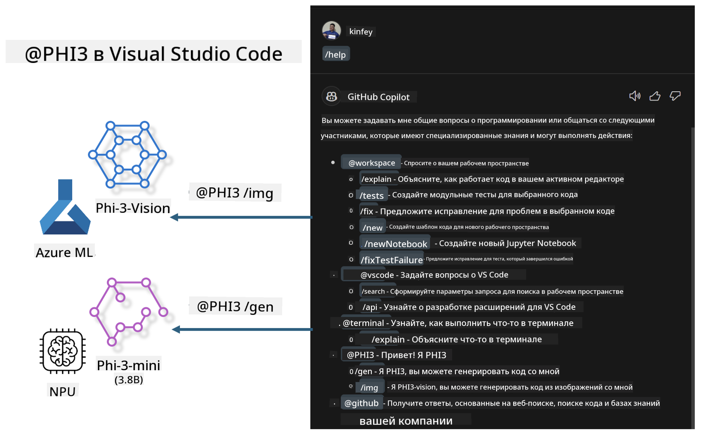

<!--
CO_OP_TRANSLATOR_METADATA:
{
  "original_hash": "00b7a699de8ac405fa821f4c0f7fc0ab",
  "translation_date": "2025-03-27T11:39:59+00:00",
  "source_file": "md\\02.Application\\02.Code\\Phi3\\VSCodeExt\\README.md",
  "language_code": "ru"
}
-->
# **Создайте свой собственный Visual Studio Code GitHub Copilot Chat с Microsoft Phi-3 Family**

Вы уже пользовались агентом рабочей области в GitHub Copilot Chat? Хотите создать собственного кодового агента для вашей команды? Эта практическая лаборатория направлена на то, чтобы объединить открытые модели для создания корпоративного кодового бизнес-агента.

## **Основы**

### **Почему стоит выбрать Microsoft Phi-3**

Семейство Phi-3 включает модели phi-3-mini, phi-3-small и phi-3-medium, которые различаются по параметрам обучения и предназначены для генерации текста, завершения диалогов и генерации кода. Также есть модель phi-3-vision для обработки изображений. Это подходящее решение для предприятий или команд, которые хотят создать автономные генеративные AI-решения.

Рекомендуем ознакомиться с этим материалом: [https://github.com/microsoft/PhiCookBook/blob/main/md/01.Introduction/01/01.PhiFamily.md](https://github.com/microsoft/PhiCookBook/blob/main/md/01.Introduction/01/01.PhiFamily.md)

### **Microsoft GitHub Copilot Chat**

Расширение GitHub Copilot Chat предоставляет интерфейс чата, который позволяет взаимодействовать с GitHub Copilot и получать ответы на вопросы, связанные с программированием, прямо в VS Code, без необходимости искать информацию в документации или на форумах.

Copilot Chat может использовать подсветку синтаксиса, отступы и другие функции форматирования для повышения читаемости ответа. В зависимости от типа вопроса, результат может содержать ссылки на контекст, использованный Copilot для генерации ответа, например, исходные файлы кода или документацию, а также кнопки для доступа к функциям VS Code.

- Copilot Chat интегрируется в процесс разработки и предоставляет помощь там, где это необходимо:

- Начинайте чат прямо из редактора или терминала, чтобы получить помощь во время кодирования.

- Используйте представление чата для получения помощи от AI-ассистента в любое время.

- Запускайте Quick Chat, чтобы задать быстрый вопрос и продолжить работу.

GitHub Copilot Chat можно использовать в различных сценариях, таких как:

- Ответы на вопросы о том, как лучше решить задачу.

- Объяснение чужого кода и предложения улучшений.

- Предложение исправлений кода.

- Генерация тестов.

- Создание документации кода.

Рекомендуем ознакомиться с этим материалом: [https://code.visualstudio.com/docs/copilot/copilot-chat](https://code.visualstudio.com/docs/copilot/copilot-chat?WT.mc_id=aiml-137032-kinfeylo)

### **Microsoft GitHub Copilot Chat @workspace**

Использование **@workspace** в Copilot Chat позволяет задавать вопросы обо всей кодовой базе. В зависимости от вопроса, Copilot интеллектуально извлекает соответствующие файлы и символы, которые затем ссылаются в ответе в виде ссылок и примеров кода.

Для ответа на ваш вопрос **@workspace** использует те же источники, что и разработчик при навигации по кодовой базе в VS Code:

- Все файлы в рабочей области, за исключением тех, которые игнорируются файлом .gitignore.

- Структура каталогов с вложенными папками и именами файлов.

- Индекс поиска кода GitHub, если рабочая область является репозиторием GitHub и индексируется поиском кода.

- Символы и определения в рабочей области.

- Текущий выделенный текст или видимый текст в активном редакторе.

Примечание: .gitignore игнорируется, если файл открыт или текст выделен в игнорируемом файле.

Рекомендуем ознакомиться с этим материалом: [https://code.visualstudio.com/docs/copilot/workspace-context](https://code.visualstudio.com/docs/copilot/workspace-context?WT.mc_id=aiml-137032-kinfeylo)

## **Подробнее об этой лаборатории**

GitHub Copilot значительно повысил эффективность программирования в компаниях, и каждая компания стремится настроить функции GitHub Copilot под свои нужды. Многие компании создают расширения, похожие на GitHub Copilot, на основе своих бизнес-сценариев и открытых моделей. Настраиваемые расширения легче контролировать, но это может повлиять на пользовательский опыт. GitHub Copilot сильнее в обработке общих сценариев и профессиональных задач. Если удастся сохранить одинаковый пользовательский опыт, настроив собственное расширение, это будет оптимальным решением. GitHub Copilot Chat предоставляет API для расширения возможностей чата. Совмещение консистентного опыта с кастомными функциями обеспечивает лучший пользовательский опыт.

Эта лаборатория использует модель Phi-3 в сочетании с локальным NPU и гибридным Azure для создания кастомного агента в GitHub Copilot Chat ***@PHI3***, который помогает разработчикам генерировать код ***(@PHI3 /gen)*** и создавать код на основе изображений ***(@PHI3 /img)***.

### ***Примечание:*** 

Эта лаборатория в настоящее время реализована на AIPC с процессорами Intel и Apple Silicon. Мы продолжим работу над версией для NPU от Qualcomm.

## **Лаборатория**

| Имя | Описание | AIPC | Apple |
| ------------ | ----------- | -------- |-------- |
| Lab0 - Установка (✅) | Настройка и установка необходимых инструментов и окружения | [Перейти](./HOL/AIPC/01.Installations.md) |[Перейти](./HOL/Apple/01.Installations.md) |
| Lab1 - Запуск Prompt flow с Phi-3-mini (✅) | Использование локального NPU на AIPC / Apple Silicon для генерации кода через Phi-3-mini | [Перейти](./HOL/AIPC/02.PromptflowWithNPU.md) |  [Перейти](./HOL/Apple/02.PromptflowWithMLX.md) |
| Lab2 - Развертывание Phi-3-vision в Azure Machine Learning Service (✅) | Генерация кода путем развертывания Phi-3-vision из каталога моделей Azure Machine Learning Service | [Перейти](./HOL/AIPC/03.DeployPhi3VisionOnAzure.md) |[Перейти](./HOL/Apple/03.DeployPhi3VisionOnAzure.md) |
| Lab3 - Создание агента @phi-3 в GitHub Copilot Chat (✅) | Создание кастомного агента Phi-3 в GitHub Copilot Chat для генерации кода, кода на основе изображений, RAG и других задач | [Перейти](./HOL/AIPC/04.CreatePhi3AgentInVSCode.md) | [Перейти](./HOL/Apple/04.CreatePhi3AgentInVSCode.md) |
| Пример кода (✅)  | Скачать пример кода | [Перейти](../../../../../../../code/07.Lab/01/AIPC) | [Перейти](../../../../../../../code/07.Lab/01/Apple) |

## **Ресурсы**

1. Phi-3 Cookbook [https://github.com/microsoft/Phi-3CookBook](https://github.com/microsoft/Phi-3CookBook)

2. Узнайте больше о GitHub Copilot [https://learn.microsoft.com/training/paths/copilot/](https://learn.microsoft.com/training/paths/copilot/?WT.mc_id=aiml-137032-kinfeylo)

3. Узнайте больше о GitHub Copilot Chat [https://learn.microsoft.com/training/paths/accelerate-app-development-using-github-copilot/](https://learn.microsoft.com/training/paths/accelerate-app-development-using-github-copilot/?WT.mc_id=aiml-137032-kinfeylo)

4. Узнайте больше о GitHub Copilot Chat API [https://code.visualstudio.com/api/extension-guides/chat](https://code.visualstudio.com/api/extension-guides/chat?WT.mc_id=aiml-137032-kinfeylo)

5. Узнайте больше об Azure AI Foundry [https://learn.microsoft.com/training/paths/create-custom-copilots-ai-studio/](https://learn.microsoft.com/training/paths/create-custom-copilots-ai-studio/?WT.mc_id=aiml-137032-kinfeylo)

6. Узнайте больше о каталоге моделей Azure AI Foundry [https://learn.microsoft.com/azure/ai-studio/how-to/model-catalog-overview](https://learn.microsoft.com/azure/ai-studio/how-to/model-catalog-overview)

**Отказ от ответственности**:  
Этот документ был переведен с использованием службы автоматического перевода [Co-op Translator](https://github.com/Azure/co-op-translator). Несмотря на наши усилия обеспечить точность, имейте в виду, что автоматический перевод может содержать ошибки или неточности. Оригинальный документ на его родном языке следует считать авторитетным источником. Для критически важной информации рекомендуется профессиональный перевод человеком. Мы не несем ответственности за недоразумения или неправильные толкования, возникающие в результате использования этого перевода.