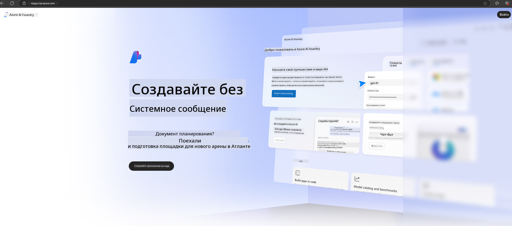

<!--
CO_OP_TRANSLATOR_METADATA:
{
  "original_hash": "3a1e48b628022485aac989c9f733e792",
  "translation_date": "2025-03-27T13:21:19+00:00",
  "source_file": "md\\02.QuickStart\\AzureAIFoundry_QuickStart.md",
  "language_code": "ru"
}
-->
# **Использование Phi-3 в Azure AI Foundry**

С развитием генеративного ИИ возникает необходимость в единой платформе для управления различными LLM и SLM, интеграции данных предприятия, выполнения операций по дообучению/RAG и оценки различных бизнес-процессов после интеграции LLM и SLM. Это позволяет лучше внедрять интеллектуальные приложения генеративного ИИ. [Azure AI Foundry](https://ai.azure.com) — это корпоративная платформа для генеративных ИИ-приложений.

С помощью Azure AI Foundry вы можете оценивать ответы больших языковых моделей (LLM) и управлять компонентами приложений с помощью "prompt flow" для повышения производительности. Платформа обеспечивает масштабируемость, что позволяет легко превращать прототипы в полноценные решения. Непрерывный мониторинг и доработка поддерживают долгосрочный успех.

Мы можем быстро развернуть модель Phi-3 в Azure AI Foundry, выполнив простые шаги, а затем использовать Azure AI Foundry для работы с Phi-3, включая Playground/Chat, дообучение, оценку и другие связанные задачи.

## **1. Подготовка**

Если на вашем устройстве уже установлен [Azure Developer CLI](https://learn.microsoft.com/azure/developer/azure-developer-cli/overview?WT.mc_id=aiml-138114-kinfeylo), использование этого шаблона сводится к выполнению одной команды в новой директории.

## Ручное создание

Создание проекта и хаба в Microsoft Azure AI Foundry — это отличный способ организовать и управлять вашей работой с ИИ. Вот пошаговое руководство, как начать:

### Создание проекта в Azure AI Foundry

1. **Перейдите в Azure AI Foundry**: Войдите в портал Azure AI Foundry.
2. **Создайте проект**:
   - Если вы уже находитесь в проекте, выберите "Azure AI Foundry" в верхнем левом углу страницы, чтобы перейти на главную страницу.
   - Нажмите "+ Создать проект".
   - Введите название проекта.
   - Если у вас есть хаб, он будет выбран по умолчанию. Если у вас есть доступ к нескольким хабам, вы можете выбрать другой из выпадающего списка. Если вы хотите создать новый хаб, выберите "Создать новый хаб" и укажите название.
   - Нажмите "Создать".

### Создание хаба в Azure AI Foundry

1. **Перейдите в Azure AI Foundry**: Войдите с вашей учетной записью Azure.
2. **Создайте хаб**:
   - Выберите "Центр управления" в левом меню.
   - Нажмите "Все ресурсы", затем стрелку вниз рядом с "+ Новый проект" и выберите "+ Новый хаб".
   - В диалоговом окне "Создать новый хаб" введите название хаба (например, contoso-hub) и при необходимости измените другие поля.
   - Нажмите "Далее", проверьте введенную информацию и затем нажмите "Создать".

Для более подробных инструкций вы можете обратиться к официальной [документации Microsoft](https://learn.microsoft.com/azure/ai-studio/how-to/create-projects).

После успешного создания вы можете получить доступ к созданной студии через [ai.azure.com](https://ai.azure.com/)

На одном AI Foundry может быть несколько проектов. Создайте проект в AI Foundry для подготовки.

Создайте Azure AI Foundry [QuickStarts](https://learn.microsoft.com/azure/ai-studio/quickstarts/get-started-code)

## **2. Развертывание модели Phi в Azure AI Foundry**

Нажмите на опцию "Explore" в проекте, чтобы перейти в каталог моделей, и выберите Phi-3.

Выберите Phi-3-mini-4k-instruct.

Нажмите "Deploy", чтобы развернуть модель Phi-3-mini-4k-instruct.

> [!NOTE]
>
> При развертывании вы можете выбрать вычислительные ресурсы.

## **3. Playground Chat Phi в Azure AI Foundry**

Перейдите на страницу развертывания, выберите Playground и начните общение с Phi-3 в Azure AI Foundry.

## **4. Развертывание модели из Azure AI Foundry**

Для развертывания модели из каталога моделей Azure вы можете выполнить следующие шаги:

- Войдите в Azure AI Foundry.
- Выберите модель, которую вы хотите развернуть, из каталога моделей Azure AI Foundry.
- На странице "Детали" модели выберите "Deploy", а затем "Serverless API with Azure AI Content Safety".
- Выберите проект, в который вы хотите развернуть свои модели. Чтобы использовать предложение Serverless API, ваш рабочий пространствo должно находиться в регионе East US 2 или Sweden Central. Вы можете настроить имя развертывания.
- В мастере развертывания выберите "Цены и условия", чтобы узнать о стоимости и условиях использования.
- Нажмите "Deploy". Дождитесь завершения развертывания и перенаправления на страницу "Deployments".
- Нажмите "Open in playground", чтобы начать взаимодействие с моделью.
- Вы можете вернуться на страницу "Deployments", выбрать развертывание и записать URL-адрес цели (Target URL) и секретный ключ (Secret Key), которые можно использовать для вызова развертывания и генерации результатов.
- Вы всегда можете найти детали конечной точки, URL и ключи доступа, перейдя на вкладку "Build" и выбрав "Deployments" в разделе "Components".

> [!NOTE]
> Обратите внимание, что ваша учетная запись должна иметь разрешения роли Azure AI Developer на группе ресурсов для выполнения этих шагов.

## **5. Использование Phi API в Azure AI Foundry**

Вы можете получить доступ к https://{Ваше имя проекта}.region.inference.ml.azure.com/swagger.json через GET-запрос в Postman и, используя ключ, ознакомиться с предоставляемыми интерфейсами.

Вы можете легко получить параметры запроса, а также параметры ответа.

**Отказ от ответственности**:  
Этот документ был переведен с использованием сервиса автоматического перевода [Co-op Translator](https://github.com/Azure/co-op-translator). Несмотря на наше стремление к точности, пожалуйста, имейте в виду, что автоматические переводы могут содержать ошибки или неточности. Оригинальный документ на исходном языке должен рассматриваться как авторитетный источник. Для получения критически важной информации рекомендуется профессиональный перевод человеком. Мы не несем ответственности за любые недоразумения или неверные интерпретации, возникшие в результате использования данного перевода.