<!--
CO_OP_TRANSLATOR_METADATA:
{
  "original_hash": "c1559c5af6caccf6f623fd43a6b3a9a3",
  "translation_date": "2025-03-27T13:43:07+00:00",
  "source_file": "md\\03.FineTuning\\FineTuning_AIFoundry.md",
  "language_code": "ru"
}
-->
# Настройка Phi-3 с помощью Azure AI Foundry

Давайте разберемся, как настроить языковую модель Microsoft Phi-3 Mini с использованием Azure AI Foundry. Тонкая настройка позволяет адаптировать Phi-3 Mini для выполнения конкретных задач, делая её ещё более мощной и контекстно-зависимой.

## Важные аспекты

- **Возможности:** Какие модели можно настраивать? Какие задачи может выполнять базовая модель после настройки?  
- **Стоимость:** Какова модель ценообразования для настройки?  
- **Настраиваемость:** Насколько можно модифицировать базовую модель и какими способами?  
- **Удобство:** Как происходит процесс настройки — нужно ли писать собственный код? Нужны ли собственные вычислительные ресурсы?  
- **Безопасность:** Настроенные модели могут нести определённые риски — предусмотрены ли меры защиты от непреднамеренного вреда?  

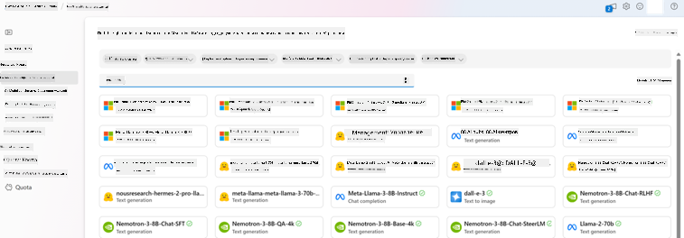

## Подготовка к настройке

### Предварительные требования

> [!NOTE]  
> Для моделей семейства Phi-3 настройка с оплатой по факту доступна только в хабах, созданных в регионах **East US 2**.

- Подписка Azure. Если у вас её нет, создайте [платный аккаунт Azure](https://azure.microsoft.com/pricing/purchase-options/pay-as-you-go), чтобы начать.  

- [Проект AI Foundry](https://ai.azure.com?WT.mc_id=aiml-138114-kinfeylo).  
- Ролевое управление доступом в Azure (Azure RBAC), которое используется для предоставления доступа к операциям в Azure AI Foundry. Для выполнения шагов из этой статьи ваша учётная запись должна быть назначена на роль __Azure AI Developer__ в группе ресурсов.  

### Регистрация поставщика подписки

Убедитесь, что подписка зарегистрирована для поставщика ресурсов `Microsoft.Network`.

1. Войдите в [портал Azure](https://portal.azure.com).  
1. Выберите **Подписки** в левом меню.  
1. Выберите подписку, которую хотите использовать.  
1. Выберите **Настройки AI проекта** > **Поставщики ресурсов** в левом меню.  
1. Убедитесь, что **Microsoft.Network** находится в списке поставщиков ресурсов. В противном случае добавьте его.  

### Подготовка данных

Подготовьте обучающие и проверочные данные для настройки модели. Ваши наборы данных должны содержать примеры входных и выходных данных, которые демонстрируют, как вы хотите, чтобы модель работала.  

Убедитесь, что все обучающие примеры соответствуют ожидаемому формату для вывода. Для эффективной настройки моделей важно иметь сбалансированный и разнообразный набор данных.  

Это включает поддержание баланса данных, включение различных сценариев и периодическое уточнение обучающих данных в соответствии с реальными ожиданиями, что в конечном итоге приводит к более точным и сбалансированным ответам модели.  

Разные типы моделей требуют разных форматов обучающих данных.  

### Завершение чата

Обучающие и проверочные данные **должны** быть отформатированы как документ JSON Lines (JSONL). Для `Phi-3-mini-128k-instruct` набор данных для настройки должен быть в формате, используемом API завершения чата.  

### Пример формата файла

```json
    {"messages": [{"role": "system", "content": "You are an Xbox customer support agent whose primary goal is to help users with issues they are experiencing with their Xbox devices. You are friendly and concise. You only provide factual answers to queries, and do not provide answers that are not related to Xbox."}, {"role": "user", "content": "Is Xbox better than PlayStation?"}, {"role": "assistant", "content": "I apologize, but I cannot provide personal opinions. My primary job is to assist you with any issues related to your Xbox device. Do you have any Xbox-related issues that need addressing?"}]}
    {"messages": [{"role": "system", "content": "You are an Xbox customer support agent whose primary goal is to help users with issues they are experiencing with their Xbox devices. You are friendly and concise. You only provide factual answers to queries, and do not provide answers that are not related to Xbox."}, {"role": "user", "content": "Can I play PC games on my Xbox?"}, {"role": "assistant", "content": "While Xbox consoles don't natively support PC games, they can play an array of Xbox games, many of which are also available on PC. Can I assist you with finding games compatible with your Xbox device?"}]}
    {"messages": [{"role": "system", "content": "You are an Xbox customer support agent whose primary goal is to help users with issues they are experiencing with their Xbox devices. You are friendly and concise. You only provide factual answers to queries, and do not provide answers that are not related to Xbox."}, {"role": "user", "content": "I'm having trouble connecting my Xbox to the Wi-Fi."}, {"role": "assistant", "content": "No worries, let's go through the network settings on your Xbox. Can you please tell me what happens when you try to connect it to the Wi-Fi?"}]}
```  

Поддерживаемый тип файла — JSON Lines. Файлы загружаются в хранилище данных по умолчанию и становятся доступными в вашем проекте.  

## Настройка Phi-3 с Azure AI Foundry

Azure AI Foundry позволяет адаптировать крупные языковые модели к вашим персональным наборам данных с помощью процесса, известного как тонкая настройка. Тонкая настройка обеспечивает значительную ценность, позволяя кастомизировать и оптимизировать модели для конкретных задач и приложений. Это приводит к улучшению производительности, снижению затрат, уменьшению задержек и созданию индивидуализированных результатов.  

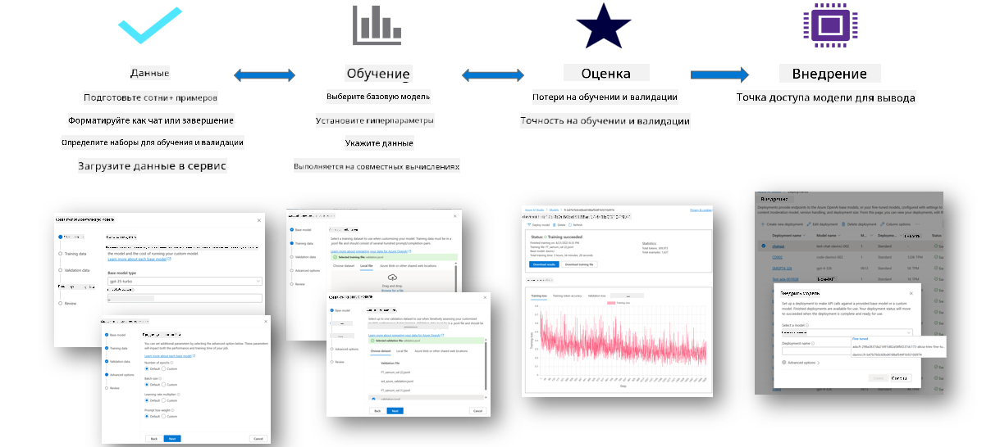

### Создание нового проекта

1. Войдите в [Azure AI Foundry](https://ai.azure.com).  

1. Выберите **+Новый проект**, чтобы создать новый проект в Azure AI Foundry.  

    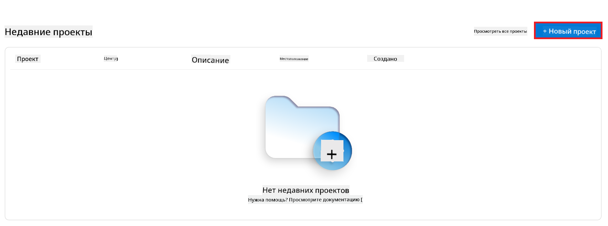  

1. Выполните следующие действия:  

    - Укажите **Имя хаба проекта**. Оно должно быть уникальным.  
    - Выберите **Хаб**, который хотите использовать (создайте новый, если это необходимо).  

    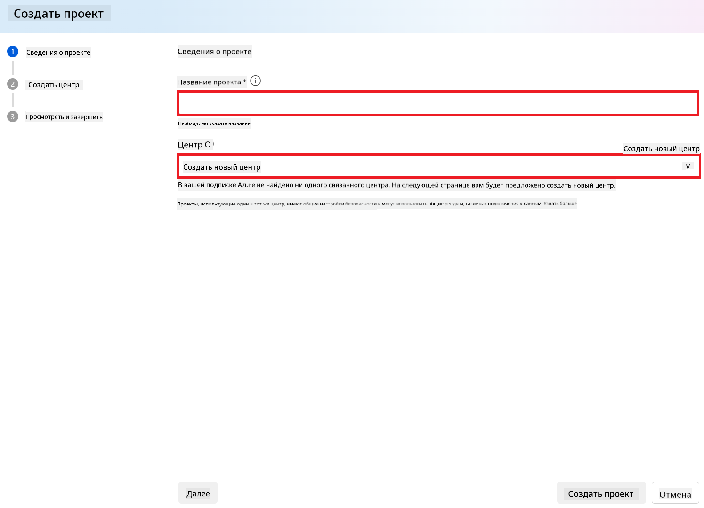  

1. Выполните следующие действия для создания нового хаба:  

    - Введите **Имя хаба**. Оно должно быть уникальным.  
    - Выберите вашу подписку Azure **Subscription**.  
    - Выберите **Группу ресурсов**, которую хотите использовать (создайте новую, если это необходимо).  
    - Выберите **Расположение**, которое хотите использовать.  
    - Выберите **Подключить службы Azure AI** (создайте новую, если это необходимо).  
    - Выберите **Пропустить подключение** для Azure AI Search.  

    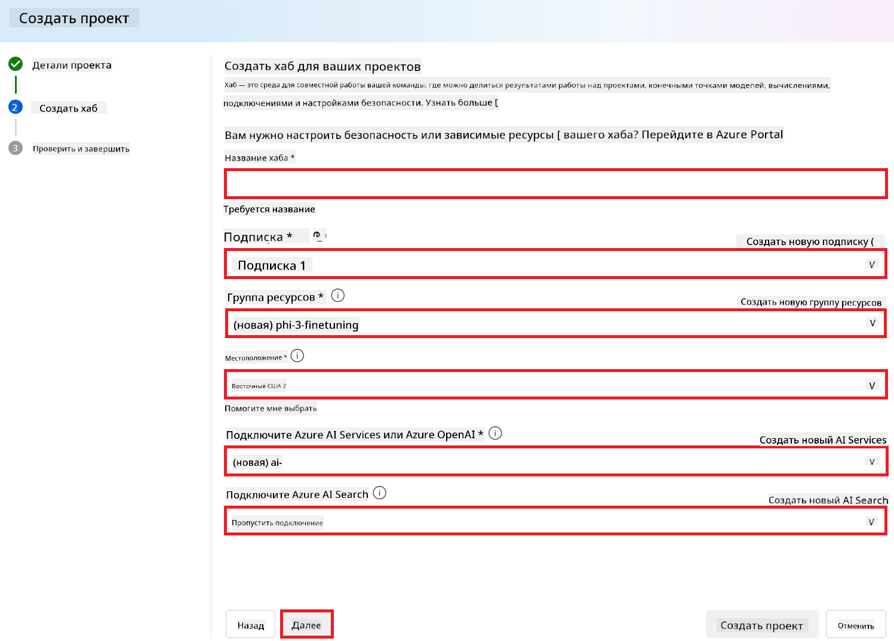  

1. Нажмите **Далее**.  
1. Выберите **Создать проект**.  

### Подготовка данных

Перед настройкой соберите или создайте набор данных, релевантный вашей задаче, например, инструкции для чата, пары вопросов и ответов или другой текст. Очистите и предварительно обработайте эти данные, удалив шум, обработав пропущенные значения и токенизировав текст.  

### Настройка моделей Phi-3 в Azure AI Foundry

> [!NOTE]  
> Настройка моделей Phi-3 в настоящее время поддерживается только в проектах, расположенных в East US 2.  

1. Выберите **Каталог моделей** в левом меню.  

1. Введите *phi-3* в **поисковой строке** и выберите модель phi-3, которую хотите использовать.  

    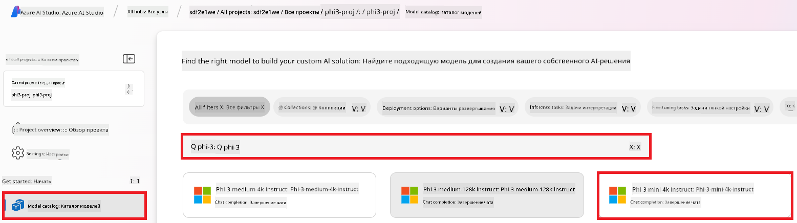  

1. Выберите **Настроить**.  

    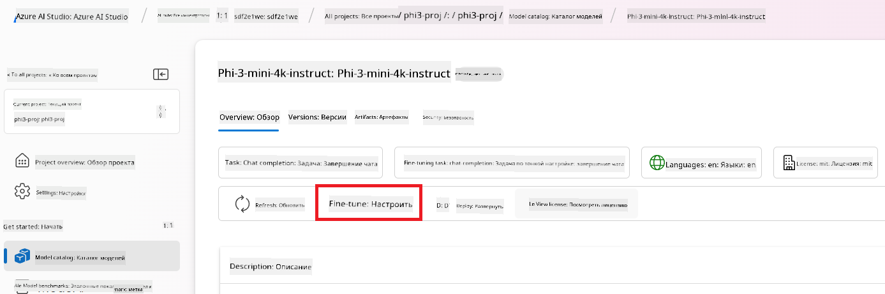  

1. Введите **Имя настроенной модели**.  

    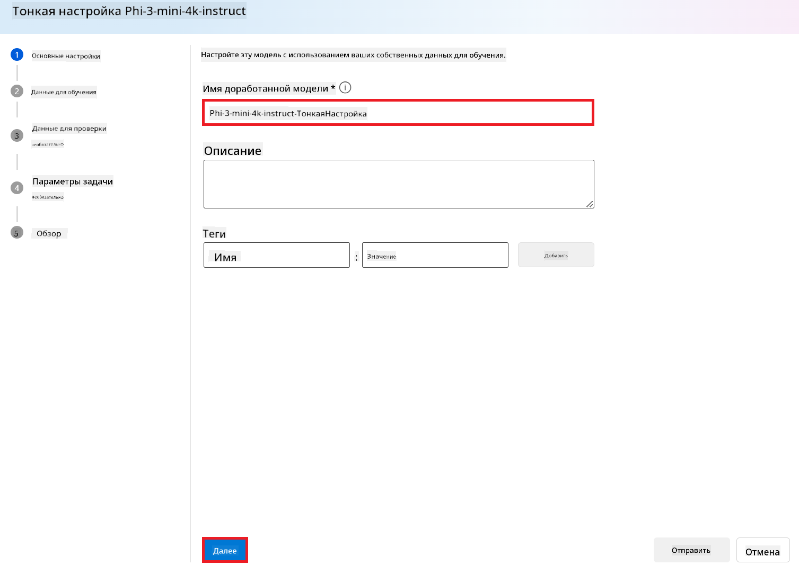  

1. Нажмите **Далее**.  

1. Выполните следующие действия:  

    - Выберите **Тип задачи** — **Завершение чата**.  
    - Выберите **Обучающие данные**, которые хотите использовать. Вы можете загрузить их через данные Azure AI Foundry или из локальной среды.  

    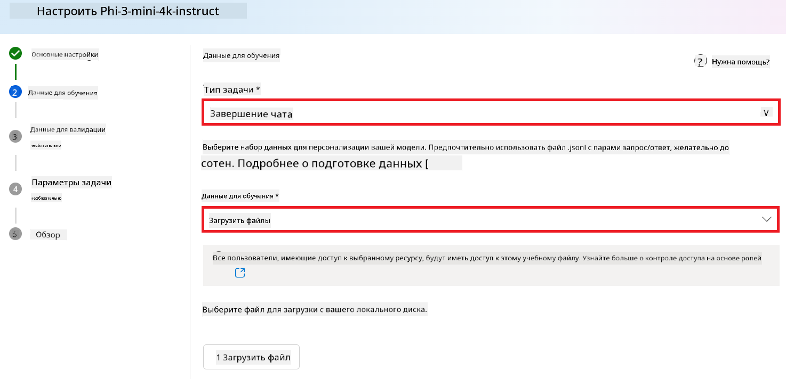  

1. Нажмите **Далее**.  

1. Загрузите **Проверочные данные**, которые хотите использовать, или выберите **Автоматическое разделение обучающих данных**.  

    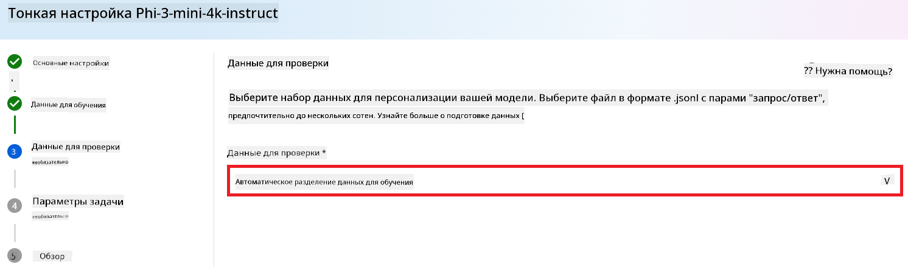  

1. Нажмите **Далее**.  

1. Выполните следующие действия:  

    - Выберите **Множитель размера пакета**, который хотите использовать.  
    - Укажите **Скорость обучения**, которую хотите использовать.  
    - Укажите **Количество эпох**, которое хотите использовать.  

      

1. Нажмите **Отправить**, чтобы запустить процесс настройки.  

    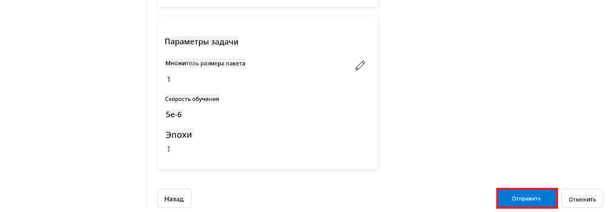  

1. После завершения настройки статус будет отображён как **Завершено**, как показано на изображении ниже. Теперь вы можете развернуть модель и использовать её в своём приложении, в рабочей области или в потоках подсказок. Для получения дополнительной информации см. [Как развернуть модели семейства Phi-3 с Azure AI Foundry](https://learn.microsoft.com/azure/ai-studio/how-to/deploy-models-phi-3?tabs=phi-3-5&pivots=programming-language-python).  

    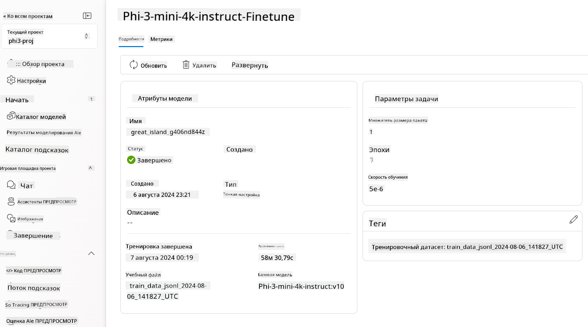  

> [!NOTE]  
> Для получения более подробной информации о настройке Phi-3 посетите [Настройка моделей Phi-3 в Azure AI Foundry](https://learn.microsoft.com/azure/ai-studio/how-to/fine-tune-phi-3?tabs=phi-3-mini).  

## Удаление настроенных моделей

Вы можете удалить настроенную модель из списка моделей настройки в [Azure AI Foundry](https://ai.azure.com) или на странице деталей модели. Выберите настроенную модель для удаления на странице настройки и нажмите кнопку Удалить, чтобы удалить модель.  

> [!NOTE]  
> Вы не можете удалить пользовательскую модель, если у неё есть активное развертывание. Сначала необходимо удалить развертывание модели, прежде чем удалять её.  

## Стоимость и квоты

### Учет стоимости и квот для настройки моделей Phi-3

Модели Phi, настроенные как услуга, предлагаются Microsoft и интегрированы с Azure AI Foundry для использования. Вы можете найти информацию о стоимости при [развертывании](https://learn.microsoft.com/azure/ai-studio/how-to/deploy-models-phi-3?tabs=phi-3-5&pivots=programming-language-python) или настройке моделей в разделе "Цены и условия" мастера развертывания.  

## Фильтрация контента

Модели, развернутые как услуга с оплатой по факту, защищены системой Azure AI Content Safety. При развертывании в режиме реального времени вы можете отказаться от этой функции. С активированной системой безопасности контента Azure AI как запрос, так и ответ проходят через классификационные модели, предназначенные для выявления и предотвращения вредоносного контента. Система фильтрации контента обнаруживает и принимает меры в отношении определённых категорий потенциально вредоносного контента как в запросах, так и в ответах. Узнайте больше о [Azure AI Content Safety](https://learn.microsoft.com/azure/ai-studio/concepts/content-filtering).  

**Конфигурация настройки**

Гиперпараметры: Определите гиперпараметры, такие как скорость обучения, размер пакета и количество эпох обучения.  

**Функция потерь**

Выберите подходящую функцию потерь для вашей задачи (например, перекрестная энтропия).  

**Оптимизатор**

Выберите оптимизатор (например, Adam) для обновления градиентов во время обучения.  

**Процесс настройки**

- Загрузка предобученной модели: Загрузите контрольную точку Phi-3 Mini.  
- Добавление пользовательских слоёв: Добавьте слои, специфичные для задачи (например, классификационную головку для инструкций чата).  

**Обучение модели**  
Настройте модель, используя подготовленный набор данных. Следите за прогрессом обучения и при необходимости корректируйте гиперпараметры.  

**Оценка и проверка**

Набор для проверки: Разделите данные на обучающий и проверочный наборы.  

**Оценка производительности**

Используйте метрики, такие как точность, F1-мера или перплексия, чтобы оценить производительность модели.  

## Сохранение настроенной модели

**Контрольная точка**  
Сохраните контрольную точку настроенной модели для дальнейшего использования.  

## Развертывание

- Развертывание как веб-службы: Разверните настроенную модель как веб-службу в Azure AI Foundry.  
- Тестирование конечной точки: Отправьте тестовые запросы на развернутую конечную точку, чтобы проверить её функциональность.  

## Итерация и улучшение

Итерация: Если производительность неудовлетворительна, повторите процесс, изменяя гиперпараметры, добавляя больше данных или увеличивая количество эпох настройки.  

## Мониторинг и уточнение

Постоянно отслеживайте поведение модели и при необходимости вносите изменения.  

## Кастомизация и расширение

Пользовательские задачи: Phi-3 Mini можно настроить для различных задач, выходящих за рамки инструкций чата. Исследуйте другие варианты использования!  
Экспериментируйте: Пробуйте разные архитектуры, комбинации слоёв и методы для повышения производительности.  

> [!NOTE]  
> Настройка — это итеративный процесс. Экспериментируйте, учитесь и адаптируйте модель, чтобы достичь наилучших результатов для вашей задачи!  

**Отказ от ответственности**:  
Этот документ был переведен с помощью сервиса автоматического перевода [Co-op Translator](https://github.com/Azure/co-op-translator). Хотя мы стремимся к точности, пожалуйста, учитывайте, что автоматический перевод может содержать ошибки или неточности. Оригинальный документ на его родном языке должен рассматриваться как авторитетный источник. Для получения критически важной информации рекомендуется профессиональный перевод человеком. Мы не несем ответственности за недоразумения или неверные интерпретации, возникающие в результате использования данного перевода.