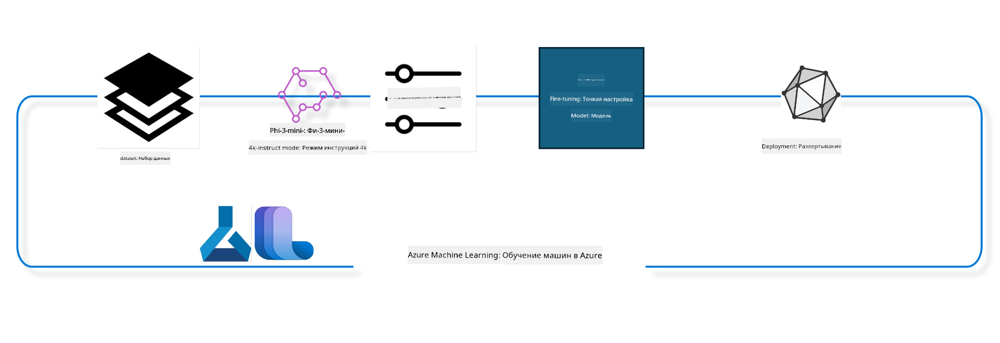

<!--
CO_OP_TRANSLATOR_METADATA:
{
  "original_hash": "944949f040e61b2ea25b3460f7394fd4",
  "translation_date": "2025-03-27T14:37:29+00:00",
  "source_file": "md\\03.FineTuning\\FineTuning_MLSDK.md",
  "language_code": "ru"
}
-->
## Как использовать компоненты для завершения чата из системного реестра Azure ML для тонкой настройки модели

В этом примере мы будем проводить тонкую настройку модели Phi-3-mini-4k-instruct для завершения диалога между двумя людьми, используя набор данных ultrachat_200k.



Пример покажет, как выполнить тонкую настройку с использованием Azure ML SDK и Python, а затем развернуть настроенную модель в онлайн-эндпоинте для выполнения инференса в реальном времени.

### Данные для обучения

Мы будем использовать набор данных ultrachat_200k. Это сильно отфильтрованная версия набора данных UltraChat, который использовался для обучения Zephyr-7B-β, передовой модели чата с 7 миллиардами параметров.

### Модель

Мы будем использовать модель Phi-3-mini-4k-instruct, чтобы показать, как пользователь может настроить модель для задачи завершения чата. Если вы открыли эту записную книжку с определённой карточки модели, не забудьте заменить имя конкретной модели.

### Задачи

- Выбрать модель для тонкой настройки.
- Выбрать и изучить данные для обучения.
- Настроить задачу тонкой настройки.
- Запустить задачу тонкой настройки.
- Просмотреть метрики обучения и оценки.
- Зарегистрировать настроенную модель.
- Развернуть настроенную модель для инференса в реальном времени.
- Очистить ресурсы.

## 1. Настройка предварительных требований

- Установить зависимости.
- Подключиться к рабочему пространству AzureML. Узнайте больше о настройке аутентификации SDK. Замените <WORKSPACE_NAME>, <RESOURCE_GROUP> и <SUBSCRIPTION_ID> ниже.
- Подключиться к системному реестру AzureML.
- Установить необязательное имя эксперимента.
- Проверить или создать вычислительный ресурс.

> [!NOTE]
> Требования: один GPU-узел может содержать несколько GPU-карт. Например, в одном узле Standard_NC24rs_v3 есть 4 NVIDIA V100 GPU, а в Standard_NC12s_v3 — 2 NVIDIA V100 GPU. Обратитесь к документации для получения этой информации. Количество GPU-карт на узел задается в параметре gpus_per_node ниже. Указание этого значения правильно обеспечит использование всех GPU в узле. Рекомендуемые конфигурации GPU-вычислений можно найти здесь и здесь.

### Библиотеки Python

Установите зависимости, выполнив следующий блок кода. Этот шаг обязателен, если вы работаете в новой среде.

```bash
pip install azure-ai-ml
pip install azure-identity
pip install datasets==2.9.0
pip install mlflow
pip install azureml-mlflow
```

### Взаимодействие с Azure ML

1. Этот Python-скрипт используется для взаимодействия с сервисом Azure Machine Learning (Azure ML). Вот его основные функции:

    - Импортирует необходимые модули из пакетов azure.ai.ml, azure.identity и azure.ai.ml.entities. Также импортирует модуль time.

    - Пытается выполнить аутентификацию с использованием DefaultAzureCredential(), который предоставляет упрощенный опыт аутентификации для быстрого начала разработки приложений в облаке Azure. Если это не удаётся, используется InteractiveBrowserCredential(), который предоставляет интерактивное окно входа.

    - Затем пытается создать экземпляр MLClient с использованием метода from_config, который считывает конфигурацию из файла config.json. Если это не удаётся, создаёт экземпляр MLClient вручную, указывая subscription_id, resource_group_name и workspace_name.

    - Создаёт ещё один экземпляр MLClient для реестра Azure ML с именем "azureml". В этом реестре хранятся модели, пайплайны тонкой настройки и окружения.

    - Устанавливает имя эксперимента в "chat_completion_Phi-3-mini-4k-instruct".

    - Генерирует уникальную временную метку, преобразуя текущее время (в секундах с момента эпохи) в целое число, а затем в строку. Эта временная метка может использоваться для создания уникальных имён и версий.

    ```python
    # Import necessary modules from Azure ML and Azure Identity
    from azure.ai.ml import MLClient
    from azure.identity import (
        DefaultAzureCredential,
        InteractiveBrowserCredential,
    )
    from azure.ai.ml.entities import AmlCompute
    import time  # Import time module
    
    # Try to authenticate using DefaultAzureCredential
    try:
        credential = DefaultAzureCredential()
        credential.get_token("https://management.azure.com/.default")
    except Exception as ex:  # If DefaultAzureCredential fails, use InteractiveBrowserCredential
        credential = InteractiveBrowserCredential()
    
    # Try to create an MLClient instance using the default config file
    try:
        workspace_ml_client = MLClient.from_config(credential=credential)
    except:  # If that fails, create an MLClient instance by manually providing the details
        workspace_ml_client = MLClient(
            credential,
            subscription_id="<SUBSCRIPTION_ID>",
            resource_group_name="<RESOURCE_GROUP>",
            workspace_name="<WORKSPACE_NAME>",
        )
    
    # Create another MLClient instance for the Azure ML registry named "azureml"
    # This registry is where models, fine-tuning pipelines, and environments are stored
    registry_ml_client = MLClient(credential, registry_name="azureml")
    
    # Set the experiment name
    experiment_name = "chat_completion_Phi-3-mini-4k-instruct"
    
    # Generate a unique timestamp that can be used for names and versions that need to be unique
    timestamp = str(int(time.time()))
    ```

## 2. Выбор базовой модели для тонкой настройки

1. Phi-3-mini-4k-instruct — это лёгкая, передовая открытая модель с 3,8 миллиардами параметров, созданная на основе наборов данных, использованных для Phi-2. Модель принадлежит семейству моделей Phi-3, а версия Mini доступна в двух вариантах: 4K и 128K, что соответствует длине контекста (в токенах), которую она может поддерживать. Для использования модели её необходимо настроить под конкретные задачи. Вы можете просмотреть эти модели в каталоге моделей AzureML Studio, отфильтровав по задаче завершения чата. В этом примере мы используем модель Phi-3-mini-4k-instruct. Если вы открыли эту записную книжку для другой модели, замените имя модели и версию соответственно.

    > [!NOTE]
    > Свойство model id модели. Оно будет передано в задачу тонкой настройки. Это также доступно в поле Asset ID на странице деталей модели в каталоге моделей AzureML Studio.

2. Этот Python-скрипт взаимодействует с сервисом Azure Machine Learning (Azure ML). Вот его основные функции:

    - Устанавливает имя модели в "Phi-3-mini-4k-instruct".

    - Использует метод get свойства models объекта registry_ml_client для получения последней версии модели с указанным именем из реестра Azure ML. Метод get вызывается с двумя аргументами: именем модели и меткой, указывающей, что должна быть получена последняя версия модели.

    - Выводит сообщение в консоль, указывающее имя, версию и id модели, которая будет использоваться для тонкой настройки. Метод format строки используется для вставки имени, версии и id модели в сообщение. Имя, версия и id модели доступны как свойства объекта foundation_model.

    ```python
    # Set the model name
    model_name = "Phi-3-mini-4k-instruct"
    
    # Get the latest version of the model from the Azure ML registry
    foundation_model = registry_ml_client.models.get(model_name, label="latest")
    
    # Print the model name, version, and id
    # This information is useful for tracking and debugging
    print(
        "\n\nUsing model name: {0}, version: {1}, id: {2} for fine tuning".format(
            foundation_model.name, foundation_model.version, foundation_model.id
        )
    )
    ```

## 3. Создание вычислительного ресурса для работы с задачей

Задача тонкой настройки работает ТОЛЬКО с GPU-вычислениями. Размер вычислительного ресурса зависит от размера модели, и в большинстве случаев бывает сложно определить подходящий ресурс для задачи. В этом блоке мы помогаем пользователю выбрать подходящий вычислительный ресурс.

> [!NOTE]
> Вычислительные ресурсы, перечисленные ниже, работают с наиболее оптимальной конфигурацией. Любые изменения конфигурации могут привести к ошибке Cuda Out Of Memory. В таких случаях попробуйте обновить вычислительный ресурс до более мощного.

> [!NOTE]
> При выборе compute_cluster_size ниже убедитесь, что вычислительный ресурс доступен в вашей группе ресурсов. Если определённый ресурс недоступен, вы можете запросить доступ к нему.

### Проверка модели на поддержку тонкой настройки

1. Этот Python-скрипт взаимодействует с моделью Azure Machine Learning (Azure ML). Вот его основные функции:

    - Импортирует модуль ast, который предоставляет функции для обработки деревьев грамматики абстрактного синтаксиса Python.

    - Проверяет, имеет ли объект foundation_model (представляющий модель в Azure ML) тег с именем finetune_compute_allow_list. Теги в Azure ML — это пары ключ-значение, которые можно создавать и использовать для фильтрации и сортировки моделей.

    - Если тег finetune_compute_allow_list присутствует, использует функцию ast.literal_eval для безопасного преобразования значения тега (строки) в список Python. Этот список затем присваивается переменной computes_allow_list. Затем выводит сообщение, указывающее, что вычислительный ресурс следует создать из списка.

    - Если тег finetune_compute_allow_list отсутствует, присваивает computes_allow_list значение None и выводит сообщение о том, что тег finetune_compute_allow_list не является частью тегов модели.

    - В целом, этот скрипт проверяет наличие определённого тега в метаданных модели, преобразует значение тега в список, если он существует, и предоставляет обратную связь пользователю.

    ```python
    # Import the ast module, which provides functions to process trees of the Python abstract syntax grammar
    import ast
    
    # Check if the 'finetune_compute_allow_list' tag is present in the model's tags
    if "finetune_compute_allow_list" in foundation_model.tags:
        # If the tag is present, use ast.literal_eval to safely parse the tag's value (a string) into a Python list
        computes_allow_list = ast.literal_eval(
            foundation_model.tags["finetune_compute_allow_list"]
        )  # convert string to python list
        # Print a message indicating that a compute should be created from the list
        print(f"Please create a compute from the above list - {computes_allow_list}")
    else:
        # If the tag is not present, set computes_allow_list to None
        computes_allow_list = None
        # Print a message indicating that the 'finetune_compute_allow_list' tag is not part of the model's tags
        print("`finetune_compute_allow_list` is not part of model tags")
    ```

### Проверка вычислительного ресурса

1. Этот Python-скрипт взаимодействует с сервисом Azure Machine Learning (Azure ML) и выполняет несколько проверок вычислительного ресурса. Вот его основные функции:

    - Пытается получить вычислительный ресурс с именем, хранящимся в compute_cluster, из рабочей области Azure ML. Если состояние ресурса "failed", выбрасывает ValueError.

    - Проверяет, не равно ли computes_allow_list значению None. Если это так, преобразует все размеры ресурсов в списке в нижний регистр и проверяет, соответствует ли размер текущего ресурса списку. Если нет, выбрасывает ValueError.

    - Если computes_allow_list равно None, проверяет, находится ли размер ресурса в списке неподдерживаемых GPU-VM размеров. Если да, выбрасывает ValueError.

    - Получает список всех доступных размеров ресурсов в рабочей области. Затем проходит по этому списку и для каждого размера проверяет, совпадает ли его имя с размером текущего ресурса. Если да, получает количество GPU для этого размера и устанавливает gpu_count_found в True.

    - Если gpu_count_found равно True, выводит количество GPU в ресурсе. Если gpu_count_found равно False, выбрасывает ValueError.

    - В целом, этот скрипт выполняет несколько проверок вычислительного ресурса в рабочей области Azure ML, включая проверку состояния, размера и количества GPU.

    ```python
    # Print the exception message
    print(e)
    # Raise a ValueError if the compute size is not available in the workspace
    raise ValueError(
        f"WARNING! Compute size {compute_cluster_size} not available in workspace"
    )
    
    # Retrieve the compute instance from the Azure ML workspace
    compute = workspace_ml_client.compute.get(compute_cluster)
    # Check if the provisioning state of the compute instance is "failed"
    if compute.provisioning_state.lower() == "failed":
        # Raise a ValueError if the provisioning state is "failed"
        raise ValueError(
            f"Provisioning failed, Compute '{compute_cluster}' is in failed state. "
            f"please try creating a different compute"
        )
    
    # Check if computes_allow_list is not None
    if computes_allow_list is not None:
        # Convert all compute sizes in computes_allow_list to lowercase
        computes_allow_list_lower_case = [x.lower() for x in computes_allow_list]
        # Check if the size of the compute instance is in computes_allow_list_lower_case
        if compute.size.lower() not in computes_allow_list_lower_case:
            # Raise a ValueError if the size of the compute instance is not in computes_allow_list_lower_case
            raise ValueError(
                f"VM size {compute.size} is not in the allow-listed computes for finetuning"
            )
    else:
        # Define a list of unsupported GPU VM sizes
        unsupported_gpu_vm_list = [
            "standard_nc6",
            "standard_nc12",
            "standard_nc24",
            "standard_nc24r",
        ]
        # Check if the size of the compute instance is in unsupported_gpu_vm_list
        if compute.size.lower() in unsupported_gpu_vm_list:
            # Raise a ValueError if the size of the compute instance is in unsupported_gpu_vm_list
            raise ValueError(
                f"VM size {compute.size} is currently not supported for finetuning"
            )
    
    # Initialize a flag to check if the number of GPUs in the compute instance has been found
    gpu_count_found = False
    # Retrieve a list of all available compute sizes in the workspace
    workspace_compute_sku_list = workspace_ml_client.compute.list_sizes()
    available_sku_sizes = []
    # Iterate over the list of available compute sizes
    for compute_sku in workspace_compute_sku_list:
        available_sku_sizes.append(compute_sku.name)
        # Check if the name of the compute size matches the size of the compute instance
        if compute_sku.name.lower() == compute.size.lower():
            # If it does, retrieve the number of GPUs for that compute size and set gpu_count_found to True
            gpus_per_node = compute_sku.gpus
            gpu_count_found = True
    # If gpu_count_found is True, print the number of GPUs in the compute instance
    if gpu_count_found:
        print(f"Number of GPU's in compute {compute.size}: {gpus_per_node}")
    else:
        # If gpu_count_found is False, raise a ValueError
        raise ValueError(
            f"Number of GPU's in compute {compute.size} not found. Available skus are: {available_sku_sizes}."
            f"This should not happen. Please check the selected compute cluster: {compute_cluster} and try again."
        )
    ```

## 4. Выбор набора данных для тонкой настройки модели

1. Мы используем набор данных ultrachat_200k. Набор данных содержит четыре раздела, подходящих для следующих задач:

    - Supervised fine-tuning (sft).
    - Generation ranking (gen). 

Количество примеров в каждом разделе показано ниже:

    ```bash
    train_sft test_sft  train_gen  test_gen
    207865  23110  256032  28304
    ```

1. Следующие несколько блоков показывают базовую подготовку данных для тонкой настройки:

### Визуализация некоторых строк данных

Мы хотим, чтобы этот пример выполнялся быстро, поэтому сохраняем файлы train_sft и test_sft, содержащие 5% уже обрезанных строк. Это означает, что настроенная модель будет иметь меньшую точность, поэтому её не следует использовать в реальных задачах. Скрипт download-dataset.py используется для загрузки набора данных ultrachat_200k и преобразования его в формат, потребляемый компонентами пайплайна тонкой настройки. Поскольку набор данных большой, здесь используется только его часть.

1. Выполнение следующего скрипта загружает только 5% данных. Это значение можно увеличить, изменив параметр dataset_split_pc на желаемый процент.

    > [!NOTE]
    > Некоторые языковые модели имеют разные коды языков, поэтому названия столбцов в наборе данных должны соответствовать этим кодам.

1. Вот пример того, как должны выглядеть данные. 

Набор данных для завершения чата хранится в формате parquet, причём каждая запись использует следующую схему:

    - Это JSON-документ (JavaScript Object Notation), популярный формат обмена данными. Это не исполняемый код, а способ хранения и передачи данных. Вот его структура:

    - "prompt": Этот ключ содержит строку, представляющую задание или вопрос, заданный AI-ассистенту.

    - "messages": Этот ключ содержит массив объектов. Каждый объект представляет сообщение в диалоге между пользователем и AI-ассистентом. Каждый объект сообщения имеет два ключа:

    - "content": Этот ключ содержит строку, представляющую содержание сообщения.
    - "role": Этот ключ содержит строку, указывающую роль отправителя сообщения. Это может быть либо "user", либо "assistant".
    - "prompt_id": Этот ключ содержит строку, представляющую уникальный идентификатор для prompt.

1. В данном конкретном JSON-документе представлен диалог, в котором пользователь просит AI-ассистента создать главного героя для антиутопической истории. Ассистент отвечает, пользователь запрашивает больше деталей, и ассистент соглашается их предоставить. Весь диалог связан с определённым prompt_id.

    ```python
    {
        // The task or question posed to an AI assistant
        "prompt": "Create a fully-developed protagonist who is challenged to survive within a dystopian society under the rule of a tyrant. ...",
        
        // An array of objects, each representing a message in a conversation between a user and an AI assistant
        "messages":[
            {
                // The content of the user's message
                "content": "Create a fully-developed protagonist who is challenged to survive within a dystopian society under the rule of a tyrant. ...",
                // The role of the entity that sent the message
                "role": "user"
            },
            {
                // The content of the assistant's message
                "content": "Name: Ava\n\n Ava was just 16 years old when the world as she knew it came crashing down. The government had collapsed, leaving behind a chaotic and lawless society. ...",
                // The role of the entity that sent the message
                "role": "assistant"
            },
            {
                // The content of the user's message
                "content": "Wow, Ava's story is so intense and inspiring! Can you provide me with more details.  ...",
                // The role of the entity that sent the message
                "role": "user"
            }, 
            {
                // The content of the assistant's message
                "content": "Certainly! ....",
                // The role of the entity that sent the message
                "role": "assistant"
            }
        ],
        
        // A unique identifier for the prompt
        "prompt_id": "d938b65dfe31f05f80eb8572964c6673eddbd68eff3db6bd234d7f1e3b86c2af"
    }
    ```

### Загрузка данных

1. Этот Python-скрипт используется для загрузки набора данных с помощью вспомогательного скрипта download-dataset.py. Вот его основные функции:

    - Импортирует модуль os, предоставляющий портативный способ использования функциональности, зависящей от операционной системы.

    - Использует функцию os.system для выполнения скрипта download-dataset.py в оболочке с определёнными аргументами командной строки. Аргументы указывают, какой набор данных загрузить (HuggingFaceH4/ultrachat_200k), в какой каталог его загрузить (ultrachat_200k_dataset) и процент данных для разбиения (5). Функция os.system возвращает код завершения команды, который сохраняется в переменной exit_status.

    - Проверяет, не равен ли exit_status значению 0. В Unix-подобных операционных системах код завершения 0 обычно указывает на успешное выполнение команды, а любое другое число — на ошибку. Если exit_status не равен 0, выбрасывает исключение с сообщением об ошибке при загрузке набора данных.

    - В целом, этот скрипт выполняет команду для загрузки набора данных с помощью вспомогательного скрипта и выбрасывает исключение в случае сбоя.

    ```python
    # Import the os module, which provides a way of using operating system dependent functionality
    import os
    
    # Use the os.system function to run the download-dataset.py script in the shell with specific command-line arguments
    # The arguments specify the dataset to download (HuggingFaceH4/ultrachat_200k), the directory to download it to (ultrachat_200k_dataset), and the percentage of the dataset to split (5)
    # The os.system function returns the exit status of the command it executed; this status is stored in the exit_status variable
    exit_status = os.system(
        "python ./download-dataset.py --dataset HuggingFaceH4/ultrachat_200k --download_dir ultrachat_200k_dataset --dataset_split_pc 5"
    )
    
    # Check if exit_status is not 0
    # In Unix-like operating systems, an exit status of 0 usually indicates that a command has succeeded, while any other number indicates an error
    # If exit_status is not 0, raise an Exception with a message indicating that there was an error downloading the dataset
    if exit_status != 0:
        raise Exception("Error downloading dataset")
    ```

### Загрузка данных в DataFrame

1. Этот Python-скрипт загружает файл в формате JSON Lines в pandas DataFrame и отображает первые 5 строк. Вот его основные функции:

    - Импортирует библиотеку pandas, мощную библиотеку для работы с данными и анализа.

    - Устанавливает максимальную ширину столбца для опций отображения pandas в 0. Это означает, что полный текст каждого столбца будет отображаться без усечения при печати DataFrame.

    - Использует функцию pd.read_json для загрузки файла train_sft.jsonl из каталога ultrachat_200k_dataset в DataFrame. Аргумент lines=True указывает, что файл находится в формате JSON Lines, где каждая строка является отдельным JSON-объектом.

    - Использует метод head для отображения первых 5 строк DataFrame. Если в DataFrame меньше 5 строк, будут отображены все.

    - В целом, этот скрипт загружает файл в формате JSON Lines в DataFrame и отображает первые 5 строк с полным текстом столбцов.

    ```python
    # Import the pandas library, which is a powerful data manipulation and analysis library
    import pandas as pd
    
    # Set the maximum column width for pandas' display options to 0
    # This means that the full text of each column will be displayed without truncation when the DataFrame is printed
    pd.set_option("display.max_colwidth", 0)
    
    # Use the pd.read_json function to load the train_sft.jsonl file from the ultrachat_200k_dataset directory into a DataFrame
    # The lines=True argument indicates that the file is in JSON Lines format, where each line is a separate JSON object
    df = pd.read_json("./ultrachat_200k_dataset/train_sft.jsonl", lines=True)
    
    # Use the head method to display the first 5 rows of the DataFrame
    # If the DataFrame has less than 5 rows, it will display all of them
    df.head()
    ```

## 5. Отправка задачи тонкой настройки с использованием модели и данных в качестве входных данных

Создайте задачу, которая использует компонент пайплайна для завершения чата. Узнайте больше обо всех параметрах, поддерживаемых для тонкой настройки.

### Определение параметров тонкой настройки

1. Параметры тонкой настройки можно разделить на 2 категории: параметры обучения и параметры оптимизации.

1. Параметры обучения определяют аспекты обучения, такие как:

    - Оптимизатор, планировщик, который использовать.
    - Метрика для оптимизации тонкой настройки.
    - Количество шагов обучения, размер пакета и т.д.

1. Параметры оптимизации помогают оптимизировать использование памяти GPU и эффективно использовать вычислительные ресурсы.

1. Ниже приведены некоторые параметры, относящиеся к этой категории. Параметры оптимизации различаются для каждой модели и упаковываются вместе с моделью для обработки этих вариаций.

    - Включение DeepSpeed и LoRA.
    - Включение обучения с использованием смешанной точности.
    - Включение многозадачного обучения.

> [!NOTE]
> Контролируемая тонкая настройка может привести к потере согласованности или катастрофическому забыванию. Мы рекомендуем проверять наличие этой проблемы и запускать этап согласования после тонкой настройки.

### Параметры тонкой настройки

1. Этот Python-скрипт настраивает параметры для тонкой настройки модели машинного обучения. Вот его основные функции:

    - Устанавливает параметры обучения по умолчанию, такие как количество эпох, размеры пакетов для обучения и оценки, скорость обучения и тип планировщика скорости обучения.

    - Устанавливает параметры оптимизации по умолчанию, такие как применение LoRA и DeepSpeed, и уровень DeepSpeed.

    - Объединяет параметры обучения и оптимизации в единый словарь finetune_parameters.

    - Проверяет, имеет ли foundation_model какие-либо параметры по умолчанию, специфичные для модели. Если да, выводит предупреждение и обновляет словарь finetune_parameters с помощью этих параметров. Функция ast.literal_eval используется для преобразования параметров из строки в словарь Python.

    - Выводит окончательный набор параметров тонкой настройки, которые будут использоваться для запуска.

    - В целом, этот скрипт настраивает и отображает параметры для тонкой настройки модели машинного обучения с возможностью переопределения параметров по умолчанию специфичными для модели.

    ```python
    # Set up default training parameters such as the number of training epochs, batch sizes for training and evaluation, learning rate, and learning rate scheduler type
    training_parameters = dict(
        num_train_epochs=3,
        per_device_train_batch_size=1,
        per_device_eval_batch_size=1,
        learning_rate=5e-6,
        lr_scheduler_type="cosine",
    )
    
    # Set up default optimization parameters such as whether to apply Layer-wise Relevance Propagation (LoRa) and DeepSpeed, and the DeepSpeed stage
    optimization_parameters = dict(
        apply_lora="true",
        apply_deepspeed="true",
        deepspeed_stage=2,
    )
    
    # Combine the training and optimization parameters into a single dictionary called finetune_parameters
    finetune_parameters = {**training_parameters, **optimization_parameters}
    
    # Check if the foundation_model has any model-specific default parameters
    # If it does, print a warning message and update the finetune_parameters dictionary with these model-specific defaults
    # The ast.literal_eval function is used to convert the model-specific defaults from a string to a Python dictionary
    if "model_specific_defaults" in foundation_model.tags:
        print("Warning! Model specific defaults exist. The defaults could be overridden.")
        finetune_parameters.update(
            ast.literal_eval(  # convert string to python dict
                foundation_model.tags["model_specific_defaults"]
            )
        )
    
    # Print the final set of fine-tuning parameters that will be used for the run
    print(
        f"The following finetune parameters are going to be set for the run: {finetune_parameters}"
    )
    ```

### Пайплайн обучения

1. Этот Python-скрипт определяет функцию для генерации отображаемого имени для пайплайна обучения модели машинного обучения, а затем вызывает эту функцию для генерации и вывода имени. Вот его основные функции:

    - Функция get_pipeline_display_name определена. Она генерирует отображаемое имя на основе различных параметров, связанных с пайплайном обучения.

    - Внутри функции рассчитывается общий размер пакета путём умножения размера пакета на устройство, количества шагов накопления градиентов, количества GPU на узел и количества узлов, используемых для тонкой настройки.

    - Получает различные другие параметры, такие как тип планировщика скорости обучения, применение DeepSpeed, уровень DeepSpeed, применение LoRA, лимит на количество контрольных точек модели и максимальную длину последовательности.

    - Конструирует строку, включающую все эти параметры, разделённые дефисами. Если применяются DeepSpeed или LoRA, строка включает "ds" с указанием уровня DeepSpeed или "lora", соответственно. Если нет, включает "nods" или "nolora".

    - Функция возвращает эту строку, которая служит отображаемым именем для пайплайна обучения.

    - После определения функции она вызывается для генерации отображаемого имени, которое затем выводится.

    - В целом, этот скрипт генерирует отображаемое имя для пайплайна обучения модели машинного обучения.
обучающий конвейер на основе различных параметров, а затем вывод имени этого конвейера. ```python
    # Define a function to generate a display name for the training pipeline
    def get_pipeline_display_name():
        # Calculate the total batch size by multiplying the per-device batch size, the number of gradient accumulation steps, the number of GPUs per node, and the number of nodes used for fine-tuning
        batch_size = (
            int(finetune_parameters.get("per_device_train_batch_size", 1))
            * int(finetune_parameters.get("gradient_accumulation_steps", 1))
            * int(gpus_per_node)
            * int(finetune_parameters.get("num_nodes_finetune", 1))
        )
        # Retrieve the learning rate scheduler type
        scheduler = finetune_parameters.get("lr_scheduler_type", "linear")
        # Retrieve whether DeepSpeed is applied
        deepspeed = finetune_parameters.get("apply_deepspeed", "false")
        # Retrieve the DeepSpeed stage
        ds_stage = finetune_parameters.get("deepspeed_stage", "2")
        # If DeepSpeed is applied, include "ds" followed by the DeepSpeed stage in the display name; if not, include "nods"
        if deepspeed == "true":
            ds_string = f"ds{ds_stage}"
        else:
            ds_string = "nods"
        # Retrieve whether Layer-wise Relevance Propagation (LoRa) is applied
        lora = finetune_parameters.get("apply_lora", "false")
        # If LoRa is applied, include "lora" in the display name; if not, include "nolora"
        if lora == "true":
            lora_string = "lora"
        else:
            lora_string = "nolora"
        # Retrieve the limit on the number of model checkpoints to keep
        save_limit = finetune_parameters.get("save_total_limit", -1)
        # Retrieve the maximum sequence length
        seq_len = finetune_parameters.get("max_seq_length", -1)
        # Construct the display name by concatenating all these parameters, separated by hyphens
        return (
            model_name
            + "-"
            + "ultrachat"
            + "-"
            + f"bs{batch_size}"
            + "-"
            + f"{scheduler}"
            + "-"
            + ds_string
            + "-"
            + lora_string
            + f"-save_limit{save_limit}"
            + f"-seqlen{seq_len}"
        )
    
    # Call the function to generate the display name
    pipeline_display_name = get_pipeline_display_name()
    # Print the display name
    print(f"Display name used for the run: {pipeline_display_name}")
    ```

### Настройка конвейера

Этот Python-скрипт определяет и настраивает конвейер машинного обучения с использованием Azure Machine Learning SDK. Вот его основные шаги:

1. Импортируются необходимые модули из Azure AI ML SDK.
2. Из реестра извлекается компонент конвейера с именем "chat_completion_pipeline".
3. Определяется задача конвейера с помощью `@pipeline` decorator and the function `create_pipeline`. The name of the pipeline is set to `pipeline_display_name`.

1. Inside the `create_pipeline` function, it initializes the fetched pipeline component with various parameters, including the model path, compute clusters for different stages, dataset splits for training and testing, the number of GPUs to use for fine-tuning, and other fine-tuning parameters.

1. It maps the output of the fine-tuning job to the output of the pipeline job. This is done so that the fine-tuned model can be easily registered, which is required to deploy the model to an online or batch endpoint.

1. It creates an instance of the pipeline by calling the `create_pipeline` function.

1. It sets the `force_rerun` setting of the pipeline to `True`, meaning that cached results from previous jobs will not be used.

1. It sets the `continue_on_step_failure` setting of the pipeline to `False`, что означает, что конвейер остановится, если какой-либо этап завершится с ошибкой.

В общем, этот скрипт определяет и настраивает конвейер машинного обучения для выполнения задачи завершения чата с использованием Azure Machine Learning SDK.

```python
    # Import necessary modules from the Azure AI ML SDK
    from azure.ai.ml.dsl import pipeline
    from azure.ai.ml import Input
    
    # Fetch the pipeline component named "chat_completion_pipeline" from the registry
    pipeline_component_func = registry_ml_client.components.get(
        name="chat_completion_pipeline", label="latest"
    )
    
    # Define the pipeline job using the @pipeline decorator and the function create_pipeline
    # The name of the pipeline is set to pipeline_display_name
    @pipeline(name=pipeline_display_name)
    def create_pipeline():
        # Initialize the fetched pipeline component with various parameters
        # These include the model path, compute clusters for different stages, dataset splits for training and testing, the number of GPUs to use for fine-tuning, and other fine-tuning parameters
        chat_completion_pipeline = pipeline_component_func(
            mlflow_model_path=foundation_model.id,
            compute_model_import=compute_cluster,
            compute_preprocess=compute_cluster,
            compute_finetune=compute_cluster,
            compute_model_evaluation=compute_cluster,
            # Map the dataset splits to parameters
            train_file_path=Input(
                type="uri_file", path="./ultrachat_200k_dataset/train_sft.jsonl"
            ),
            test_file_path=Input(
                type="uri_file", path="./ultrachat_200k_dataset/test_sft.jsonl"
            ),
            # Training settings
            number_of_gpu_to_use_finetuning=gpus_per_node,  # Set to the number of GPUs available in the compute
            **finetune_parameters
        )
        return {
            # Map the output of the fine tuning job to the output of pipeline job
            # This is done so that we can easily register the fine tuned model
            # Registering the model is required to deploy the model to an online or batch endpoint
            "trained_model": chat_completion_pipeline.outputs.mlflow_model_folder
        }
    
    # Create an instance of the pipeline by calling the create_pipeline function
    pipeline_object = create_pipeline()
    
    # Don't use cached results from previous jobs
    pipeline_object.settings.force_rerun = True
    
    # Set continue on step failure to False
    # This means that the pipeline will stop if any step fails
    pipeline_object.settings.continue_on_step_failure = False
    ```

### Отправка задачи

1. Этот Python-скрипт отправляет задачу конвейера машинного обучения в рабочее пространство Azure Machine Learning и ожидает завершения задачи. Вот его основные шаги:

- Метод create_or_update объекта jobs в workspace_ml_client вызывается для отправки задачи конвейера. Конвейер, который будет запущен, указан в pipeline_object, а эксперимент, под которым выполняется задача, указан в experiment_name.
- Метод stream объекта jobs в workspace_ml_client вызывается для ожидания завершения задачи конвейера. Задача, которую нужно дождаться, указана атрибутом name объекта pipeline_job.

В общем, этот скрипт отправляет задачу конвейера машинного обучения в рабочее пространство Azure Machine Learning и ожидает завершения задачи.

```python
    # Submit the pipeline job to the Azure Machine Learning workspace
    # The pipeline to be run is specified by pipeline_object
    # The experiment under which the job is run is specified by experiment_name
    pipeline_job = workspace_ml_client.jobs.create_or_update(
        pipeline_object, experiment_name=experiment_name
    )
    
    # Wait for the pipeline job to complete
    # The job to wait for is specified by the name attribute of the pipeline_job object
    workspace_ml_client.jobs.stream(pipeline_job.name)
    ```

## 6. Регистрация дообученной модели в рабочем пространстве

Мы зарегистрируем модель, полученную в результате задачи дообучения. Это позволит отслеживать связь между дообученной моделью и задачей дообучения. Задача дообучения также отслеживает связь с базовой моделью, данными и кодом обучения.

### Регистрация ML-модели

1. Этот Python-скрипт регистрирует модель машинного обучения, обученную в конвейере Azure Machine Learning. Вот его основные шаги:

- Импортируются необходимые модули из Azure AI ML SDK.
- Проверяется, доступен ли выходной результат trained_model из задачи конвейера, путем вызова метода get объекта jobs в workspace_ml_client и доступа к атрибуту outputs.
- Формируется путь к обученной модели путем форматирования строки с именем задачи конвейера и именем выходного результата ("trained_model").
- Определяется имя для дообученной модели, добавляя "-ultrachat-200k" к оригинальному имени модели и заменяя любые слэши на дефисы.
- Подготавливается регистрация модели путем создания объекта Model с различными параметрами, включая путь к модели, тип модели (MLflow модель), имя и версию модели, а также описание модели.
- Модель регистрируется путем вызова метода create_or_update объекта models в workspace_ml_client с объектом Model в качестве аргумента.
- Выводится зарегистрированная модель.

В общем, этот скрипт регистрирует модель машинного обучения, обученную в конвейере Azure Machine Learning.

```python
    # Import necessary modules from the Azure AI ML SDK
    from azure.ai.ml.entities import Model
    from azure.ai.ml.constants import AssetTypes
    
    # Check if the `trained_model` output is available from the pipeline job
    print("pipeline job outputs: ", workspace_ml_client.jobs.get(pipeline_job.name).outputs)
    
    # Construct a path to the trained model by formatting a string with the name of the pipeline job and the name of the output ("trained_model")
    model_path_from_job = "azureml://jobs/{0}/outputs/{1}".format(
        pipeline_job.name, "trained_model"
    )
    
    # Define a name for the fine-tuned model by appending "-ultrachat-200k" to the original model name and replacing any slashes with hyphens
    finetuned_model_name = model_name + "-ultrachat-200k"
    finetuned_model_name = finetuned_model_name.replace("/", "-")
    
    print("path to register model: ", model_path_from_job)
    
    # Prepare to register the model by creating a Model object with various parameters
    # These include the path to the model, the type of the model (MLflow model), the name and version of the model, and a description of the model
    prepare_to_register_model = Model(
        path=model_path_from_job,
        type=AssetTypes.MLFLOW_MODEL,
        name=finetuned_model_name,
        version=timestamp,  # Use timestamp as version to avoid version conflict
        description=model_name + " fine tuned model for ultrachat 200k chat-completion",
    )
    
    print("prepare to register model: \n", prepare_to_register_model)
    
    # Register the model by calling the create_or_update method of the models object in the workspace_ml_client with the Model object as the argument
    registered_model = workspace_ml_client.models.create_or_update(
        prepare_to_register_model
    )
    
    # Print the registered model
    print("registered model: \n", registered_model)
    ```

## 7. Развертывание дообученной модели на онлайн-эндпоинт

Онлайн-эндпоинты предоставляют надежный REST API, который можно использовать для интеграции с приложениями, требующими использования модели.

### Управление эндпоинтом

1. Этот Python-скрипт создает управляемый онлайн-эндпоинт в Azure Machine Learning для зарегистрированной модели. Вот его основные шаги:

- Импортируются необходимые модули из Azure AI ML SDK.
- Определяется уникальное имя для онлайн-эндпоинта, добавляя временную метку к строке "ultrachat-completion-".
- Подготавливается создание онлайн-эндпоинта путем создания объекта ManagedOnlineEndpoint с различными параметрами, включая имя эндпоинта, описание эндпоинта и режим аутентификации ("key").
- Онлайн-эндпоинт создается путем вызова метода begin_create_or_update объекта workspace_ml_client с объектом ManagedOnlineEndpoint в качестве аргумента. Затем ожидается завершение операции создания путем вызова метода wait.

В общем, этот скрипт создает управляемый онлайн-эндпоинт в Azure Machine Learning для зарегистрированной модели.

```python
    # Import necessary modules from the Azure AI ML SDK
    from azure.ai.ml.entities import (
        ManagedOnlineEndpoint,
        ManagedOnlineDeployment,
        ProbeSettings,
        OnlineRequestSettings,
    )
    
    # Define a unique name for the online endpoint by appending a timestamp to the string "ultrachat-completion-"
    online_endpoint_name = "ultrachat-completion-" + timestamp
    
    # Prepare to create the online endpoint by creating a ManagedOnlineEndpoint object with various parameters
    # These include the name of the endpoint, a description of the endpoint, and the authentication mode ("key")
    endpoint = ManagedOnlineEndpoint(
        name=online_endpoint_name,
        description="Online endpoint for "
        + registered_model.name
        + ", fine tuned model for ultrachat-200k-chat-completion",
        auth_mode="key",
    )
    
    # Create the online endpoint by calling the begin_create_or_update method of the workspace_ml_client with the ManagedOnlineEndpoint object as the argument
    # Then wait for the creation operation to complete by calling the wait method
    workspace_ml_client.begin_create_or_update(endpoint).wait()
    ```

> [!NOTE]
> Здесь вы можете найти список SKU, поддерживаемых для развертывания - [Managed online endpoints SKU list](https://learn.microsoft.com/azure/machine-learning/reference-managed-online-endpoints-vm-sku-list)

### Развертывание ML-модели

1. Этот Python-скрипт развертывает зарегистрированную модель машинного обучения на управляемый онлайн-эндпоинт в Azure Machine Learning. Вот его основные шаги:

- Импортируется модуль ast, который предоставляет функции для обработки деревьев синтаксической грамматики Python.
- Устанавливается тип экземпляра для развертывания "Standard_NC6s_v3".
- Проверяется наличие тега inference_compute_allow_list в базовой модели. Если тег присутствует, его значение преобразуется из строки в список Python и присваивается переменной inference_computes_allow_list. Если тег отсутствует, переменной присваивается значение None.
- Проверяется, находится ли указанный тип экземпляра в списке разрешенных. Если он отсутствует, выводится сообщение с просьбой выбрать тип экземпляра из списка разрешенных.
- Подготавливается создание развертывания путем создания объекта ManagedOnlineDeployment с различными параметрами, включая имя развертывания, имя эндпоинта, идентификатор модели, тип и количество экземпляров, настройки проверки работоспособности и настройки запросов.
- Развертывание создается путем вызова метода begin_create_or_update объекта workspace_ml_client с объектом ManagedOnlineDeployment в качестве аргумента. Затем ожидается завершение операции развертывания путем вызова метода wait.
- Устанавливается трафик эндпоинта для направления 100% трафика на развертывание "demo".
- Эндпоинт обновляется путем вызова метода begin_create_or_update объекта workspace_ml_client с объектом эндпоинта в качестве аргумента. Затем ожидается завершение операции обновления путем вызова метода result.

В общем, этот скрипт развертывает зарегистрированную модель машинного обучения на управляемый онлайн-эндпоинт в Azure Machine Learning.

```python
    # Import the ast module, which provides functions to process trees of the Python abstract syntax grammar
    import ast
    
    # Set the instance type for the deployment
    instance_type = "Standard_NC6s_v3"
    
    # Check if the `inference_compute_allow_list` tag is present in the foundation model
    if "inference_compute_allow_list" in foundation_model.tags:
        # If it is, convert the tag value from a string to a Python list and assign it to `inference_computes_allow_list`
        inference_computes_allow_list = ast.literal_eval(
            foundation_model.tags["inference_compute_allow_list"]
        )
        print(f"Please create a compute from the above list - {computes_allow_list}")
    else:
        # If it's not, set `inference_computes_allow_list` to `None`
        inference_computes_allow_list = None
        print("`inference_compute_allow_list` is not part of model tags")
    
    # Check if the specified instance type is in the allow list
    if (
        inference_computes_allow_list is not None
        and instance_type not in inference_computes_allow_list
    ):
        print(
            f"`instance_type` is not in the allow listed compute. Please select a value from {inference_computes_allow_list}"
        )
    
    # Prepare to create the deployment by creating a `ManagedOnlineDeployment` object with various parameters
    demo_deployment = ManagedOnlineDeployment(
        name="demo",
        endpoint_name=online_endpoint_name,
        model=registered_model.id,
        instance_type=instance_type,
        instance_count=1,
        liveness_probe=ProbeSettings(initial_delay=600),
        request_settings=OnlineRequestSettings(request_timeout_ms=90000),
    )
    
    # Create the deployment by calling the `begin_create_or_update` method of the `workspace_ml_client` with the `ManagedOnlineDeployment` object as the argument
    # Then wait for the creation operation to complete by calling the `wait` method
    workspace_ml_client.online_deployments.begin_create_or_update(demo_deployment).wait()
    
    # Set the traffic of the endpoint to direct 100% of the traffic to the "demo" deployment
    endpoint.traffic = {"demo": 100}
    
    # Update the endpoint by calling the `begin_create_or_update` method of the `workspace_ml_client` with the `endpoint` object as the argument
    # Then wait for the update operation to complete by calling the `result` method
    workspace_ml_client.begin_create_or_update(endpoint).result()
    ```

## 8. Тестирование эндпоинта с тестовыми данными

Мы извлечем некоторые тестовые данные из тестового набора данных и отправим их на онлайн-эндпоинт для выполнения предсказания. Затем мы покажем предсказанные метки вместе с истинными метками.

### Чтение результатов

1. Этот Python-скрипт читает файл формата JSON Lines в pandas DataFrame, берет случайную выборку и сбрасывает индекс. Вот его основные шаги:

- Файл ./ultrachat_200k_dataset/test_gen.jsonl читается в pandas DataFrame. Функция read_json используется с аргументом lines=True, поскольку файл имеет формат JSON Lines, где каждая строка является отдельным JSON-объектом.
- Берется случайная выборка из 1 строки из DataFrame. Функция sample используется с аргументом n=1 для указания количества случайных строк, которые нужно выбрать.
- Сбрасывается индекс DataFrame. Функция reset_index используется с аргументом drop=True для удаления оригинального индекса и замены его новым индексом с значениями целых чисел по умолчанию.
- Отображаются первые 2 строки DataFrame с помощью функции head с аргументом 2. Однако, поскольку DataFrame содержит только одну строку после выборки, будет отображена только эта строка.

В общем, этот скрипт читает файл формата JSON Lines в pandas DataFrame, берет случайную выборку из 1 строки, сбрасывает индекс и отображает первую строку.

```python
    # Import pandas library
    import pandas as pd
    
    # Read the JSON Lines file './ultrachat_200k_dataset/test_gen.jsonl' into a pandas DataFrame
    # The 'lines=True' argument indicates that the file is in JSON Lines format, where each line is a separate JSON object
    test_df = pd.read_json("./ultrachat_200k_dataset/test_gen.jsonl", lines=True)
    
    # Take a random sample of 1 row from the DataFrame
    # The 'n=1' argument specifies the number of random rows to select
    test_df = test_df.sample(n=1)
    
    # Reset the index of the DataFrame
    # The 'drop=True' argument indicates that the original index should be dropped and replaced with a new index of default integer values
    # The 'inplace=True' argument indicates that the DataFrame should be modified in place (without creating a new object)
    test_df.reset_index(drop=True, inplace=True)
    
    # Display the first 2 rows of the DataFrame
    # However, since the DataFrame only contains one row after the sampling, this will only display that one row
    test_df.head(2)
    ```

### Создание JSON-объекта

1. Этот Python-скрипт создает JSON-объект с определенными параметрами и сохраняет его в файл. Вот его основные шаги:

- Импортируется модуль json, который предоставляет функции для работы с JSON-данными.
- Создается словарь parameters с ключами и значениями, представляющими параметры для модели машинного обучения. Ключи: "temperature", "top_p", "do_sample" и "max_new_tokens", их соответствующие значения: 0.6, 0.9, True и 200.
- Создается другой словарь test_json с двумя ключами: "input_data" и "params". Значение "input_data" — это другой словарь с ключами "input_string" и "parameters". Значение "input_string" — это список, содержащий первое сообщение из DataFrame test_df. Значение "parameters" — это словарь parameters, созданный ранее. Значение "params" — это пустой словарь.
- Открывается файл с именем sample_score.json.

```python
    # Import the json module, which provides functions to work with JSON data
    import json
    
    # Create a dictionary `parameters` with keys and values that represent parameters for a machine learning model
    # The keys are "temperature", "top_p", "do_sample", and "max_new_tokens", and their corresponding values are 0.6, 0.9, True, and 200 respectively
    parameters = {
        "temperature": 0.6,
        "top_p": 0.9,
        "do_sample": True,
        "max_new_tokens": 200,
    }
    
    # Create another dictionary `test_json` with two keys: "input_data" and "params"
    # The value of "input_data" is another dictionary with keys "input_string" and "parameters"
    # The value of "input_string" is a list containing the first message from the `test_df` DataFrame
    # The value of "parameters" is the `parameters` dictionary created earlier
    # The value of "params" is an empty dictionary
    test_json = {
        "input_data": {
            "input_string": [test_df["messages"][0]],
            "parameters": parameters,
        },
        "params": {},
    }
    
    # Open a file named `sample_score.json` in the `./ultrachat_200k_dataset` directory in write mode
    with open("./ultrachat_200k_dataset/sample_score.json", "w") as f:
        # Write the `test_json` dictionary to the file in JSON format using the `json.dump` function
        json.dump(test_json, f)
    ```

### Вызов эндпоинта

1. Этот Python-скрипт вызывает онлайн-эндпоинт в Azure Machine Learning для оценки JSON-файла. Вот его основные шаги:

- Метод invoke свойства online_endpoints объекта workspace_ml_client вызывается для отправки запроса на онлайн-эндпоинт и получения ответа.
- Указывается имя эндпоинта и развертывания с аргументами endpoint_name и deployment_name. В данном случае имя эндпоинта хранится в переменной online_endpoint_name, а имя развертывания — "demo".
- Указывается путь к JSON-файлу для оценки с аргументом request_file. В данном случае файл находится в ./ultrachat_200k_dataset/sample_score.json.
- Ответ от эндпоинта сохраняется в переменной response.
- Выводится необработанный ответ.

В общем, этот скрипт вызывает онлайн-эндпоинт в Azure Machine Learning для оценки JSON-файла и выводит ответ.

```python
    # Invoke the online endpoint in Azure Machine Learning to score the `sample_score.json` file
    # The `invoke` method of the `online_endpoints` property of the `workspace_ml_client` object is used to send a request to an online endpoint and get a response
    # The `endpoint_name` argument specifies the name of the endpoint, which is stored in the `online_endpoint_name` variable
    # The `deployment_name` argument specifies the name of the deployment, which is "demo"
    # The `request_file` argument specifies the path to the JSON file to be scored, which is `./ultrachat_200k_dataset/sample_score.json`
    response = workspace_ml_client.online_endpoints.invoke(
        endpoint_name=online_endpoint_name,
        deployment_name="demo",
        request_file="./ultrachat_200k_dataset/sample_score.json",
    )
    
    # Print the raw response from the endpoint
    print("raw response: \n", response, "\n")
    ```

## 9. Удаление онлайн-эндпоинта

1. Не забудьте удалить онлайн-эндпоинт, иначе счетчик будет продолжать начислять оплату за вычислительные ресурсы, используемые эндпоинтом. Этот фрагмент Python-кода удаляет онлайн-эндпоинт в Azure Machine Learning. Вот его основные шаги:

- Метод begin_delete свойства online_endpoints объекта workspace_ml_client вызывается для начала удаления онлайн-эндпоинта.
- Указывается имя эндпоинта для удаления с аргументом name. В данном случае имя эндпоинта хранится в переменной online_endpoint_name.
- Метод wait вызывается для ожидания завершения операции удаления. Это блокирующая операция, что означает, что скрипт не продолжится, пока удаление не завершится.

В общем, этот фрагмент кода начинает удаление онлайн-эндпоинта в Azure Machine Learning и ожидает завершения операции.

```python
    # Delete the online endpoint in Azure Machine Learning
    # The `begin_delete` method of the `online_endpoints` property of the `workspace_ml_client` object is used to start the deletion of an online endpoint
    # The `name` argument specifies the name of the endpoint to be deleted, which is stored in the `online_endpoint_name` variable
    # The `wait` method is called to wait for the deletion operation to complete. This is a blocking operation, meaning that it will prevent the script from continuing until the deletion is finished
    workspace_ml_client.online_endpoints.begin_delete(name=online_endpoint_name).wait()
    ```

**Отказ от ответственности**:  
Этот документ был переведен с помощью сервиса автоматического перевода [Co-op Translator](https://github.com/Azure/co-op-translator). Хотя мы стремимся к точности, пожалуйста, учитывайте, что автоматические переводы могут содержать ошибки или неточности. Оригинальный документ на его родном языке следует считать авторитетным источником. Для получения критически важной информации рекомендуется профессиональный перевод человеком. Мы не несем ответственности за любые недоразумения или неверные интерпретации, возникающие в результате использования данного перевода.