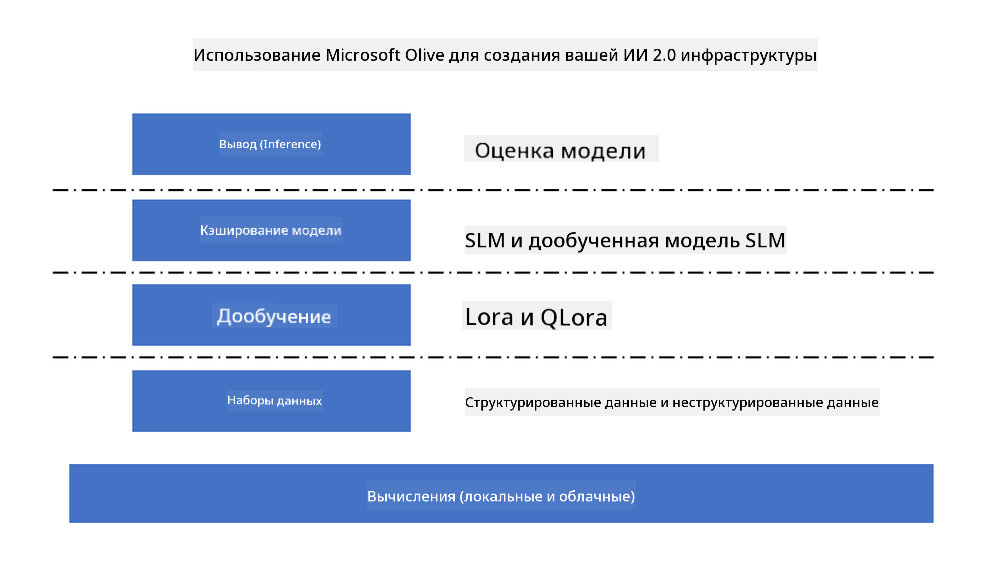
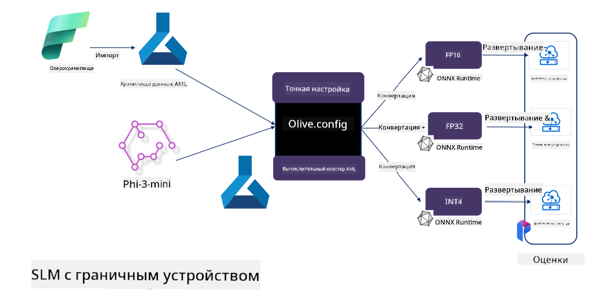

<!--
CO_OP_TRANSLATOR_METADATA:
{
  "original_hash": "5764be88ad2eb4f341e742eb8f14fab1",
  "translation_date": "2025-03-27T14:09:02+00:00",
  "source_file": "md\\03.FineTuning\\FineTuning_MicrosoftOlive.md",
  "language_code": "ru"
}
-->
# **Тонкая настройка Phi-3 с Microsoft Olive**

[Olive](https://github.com/microsoft/OLive?WT.mc_id=aiml-138114-kinfeylo) — это простой в использовании инструмент оптимизации моделей, учитывающий особенности оборудования, который объединяет передовые методы сжатия, оптимизации и компиляции моделей.

Он разработан для упрощения процесса оптимизации моделей машинного обучения, обеспечивая их максимально эффективное использование определенных архитектур оборудования.

Независимо от того, работаете ли вы над облачными приложениями или устройствами на границе сети, Olive позволяет легко и эффективно оптимизировать ваши модели.

## Основные особенности:
- Olive объединяет и автоматизирует методы оптимизации для заданных аппаратных целей.
- Поскольку ни один метод оптимизации не подходит для всех сценариев, Olive предоставляет возможность расширения, позволяя экспертам отрасли внедрять свои инновационные подходы к оптимизации.

## Снижение инженерных усилий:
- Разработчикам часто приходится изучать и использовать множество инструментов, специфичных для различных поставщиков оборудования, чтобы подготовить и оптимизировать обученные модели для развертывания.
- Olive упрощает этот процесс, автоматизируя методы оптимизации для заданного оборудования.

## Готовое решение для E2E оптимизации:

Объединяя и настраивая интегрированные методы, Olive предлагает единое решение для сквозной оптимизации.
Он учитывает ограничения, такие как точность и задержка, при оптимизации моделей.

## Использование Microsoft Olive для тонкой настройки

Microsoft Olive — это очень простой в использовании инструмент с открытым исходным кодом для оптимизации моделей, который подходит как для тонкой настройки, так и для применения в области генеративного искусственного интеллекта. С помощью простой конфигурации, в сочетании с использованием небольших языковых моделей с открытым исходным кодом и связанных сред выполнения (AzureML / локальный GPU, CPU, DirectML), вы можете выполнить тонкую настройку или применение модели через автоматическую оптимизацию и найти лучшую модель для развертывания в облаке или на устройствах на границе сети. Это позволяет предприятиям создавать собственные отраслевые вертикальные модели как локально, так и в облаке.



## Тонкая настройка Phi-3 с Microsoft Olive 



## Пример кода и пример использования Phi-3 с Olive
В этом примере вы будете использовать Olive для:

- Тонкой настройки адаптера LoRA для классификации фраз на категории: Печаль, Радость, Страх, Удивление.
- Объединения весов адаптера с базовой моделью.
- Оптимизации и квантования модели в формат int4.

[Пример кода](../../code/03.Finetuning/olive-ort-example/README.md)

### Установка Microsoft Olive

Установка Microsoft Olive очень проста и может быть выполнена для CPU, GPU, DirectML и Azure ML.

```bash
pip install olive-ai
```

Если вы хотите запустить модель ONNX на CPU, вы можете использовать:

```bash
pip install olive-ai[cpu]
```

Если вы хотите запустить модель ONNX на GPU, вы можете использовать:

```python
pip install olive-ai[gpu]
```

Если вы хотите использовать Azure ML, используйте:

```python
pip install git+https://github.com/microsoft/Olive#egg=olive-ai[azureml]
```

**Замечание**
Требования к ОС: Ubuntu 20.04 / 22.04 

### **Config.json Microsoft Olive**

После установки вы можете настроить различные параметры, специфичные для модели, через файл конфигурации Config, включая данные, вычисления, обучение, развертывание и генерацию модели.

**1. Данные**

На Microsoft Olive поддерживается обучение на локальных данных и данных в облаке, что можно настроить в параметрах.

*Настройки локальных данных*

Вы можете просто настроить набор данных, который необходимо обучить для тонкой настройки, обычно в формате json, и адаптировать его к шаблону данных. Это нужно корректировать в зависимости от требований модели (например, адаптировать к формату, требуемому Microsoft Phi-3-mini. Если у вас есть другие модели, пожалуйста, ознакомьтесь с требованиями к форматам тонкой настройки для других моделей).

```json

    "data_configs": [
        {
            "name": "dataset_default_train",
            "type": "HuggingfaceContainer",
            "load_dataset_config": {
                "params": {
                    "data_name": "json", 
                    "data_files":"dataset/dataset-classification.json",
                    "split": "train"
                }
            },
            "pre_process_data_config": {
                "params": {
                    "dataset_type": "corpus",
                    "text_cols": [
                            "phrase",
                            "tone"
                    ],
                    "text_template": "### Text: {phrase}\n### The tone is:\n{tone}",
                    "corpus_strategy": "join",
                    "source_max_len": 2048,
                    "pad_to_max_len": false,
                    "use_attention_mask": false
                }
            }
        }
    ],
```

**Настройки облачного источника данных**

С помощью подключения хранилища данных Azure AI Studio/Azure Machine Learning Service вы можете связать данные в облаке, выбрав различные источники данных через Microsoft Fabric и Azure Data для поддержки тонкой настройки данных.

```json

    "data_configs": [
        {
            "name": "dataset_default_train",
            "type": "HuggingfaceContainer",
            "load_dataset_config": {
                "params": {
                    "data_name": "json", 
                    "data_files": {
                        "type": "azureml_datastore",
                        "config": {
                            "azureml_client": {
                                "subscription_id": "Your Azure Subscrition ID",
                                "resource_group": "Your Azure Resource Group",
                                "workspace_name": "Your Azure ML Workspaces name"
                            },
                            "datastore_name": "workspaceblobstore",
                            "relative_path": "Your train_data.json Azure ML Location"
                        }
                    },
                    "split": "train"
                }
            },
            "pre_process_data_config": {
                "params": {
                    "dataset_type": "corpus",
                    "text_cols": [
                            "Question",
                            "Best Answer"
                    ],
                    "text_template": "<|user|>\n{Question}<|end|>\n<|assistant|>\n{Best Answer}\n<|end|>",
                    "corpus_strategy": "join",
                    "source_max_len": 2048,
                    "pad_to_max_len": false,
                    "use_attention_mask": false
                }
            }
        }
    ],
    
```

**2. Конфигурация вычислений**

Если требуется локальная настройка, можно использовать локальные ресурсы данных. Если требуется использование ресурсов Azure AI Studio / Azure Machine Learning Service, необходимо настроить соответствующие параметры Azure, название вычислительных ресурсов и т.д.

```json

    "systems": {
        "aml": {
            "type": "AzureML",
            "config": {
                "accelerators": ["gpu"],
                "hf_token": true,
                "aml_compute": "Your Azure AI Studio / Azure Machine Learning Service Compute Name",
                "aml_docker_config": {
                    "base_image": "Your Azure AI Studio / Azure Machine Learning Service docker",
                    "conda_file_path": "conda.yaml"
                }
            }
        },
        "azure_arc": {
            "type": "AzureML",
            "config": {
                "accelerators": ["gpu"],
                "aml_compute": "Your Azure AI Studio / Azure Machine Learning Service Compute Name",
                "aml_docker_config": {
                    "base_image": "Your Azure AI Studio / Azure Machine Learning Service docker",
                    "conda_file_path": "conda.yaml"
                }
            }
        }
    },
```

***Замечание***

Поскольку запуск осуществляется через контейнер на Azure AI Studio/Azure Machine Learning Service, необходимо настроить требуемую среду. Это настраивается в окружении conda.yaml.

```yaml

name: project_environment
channels:
  - defaults
dependencies:
  - python=3.8.13
  - pip=22.3.1
  - pip:
      - einops
      - accelerate
      - azure-keyvault-secrets
      - azure-identity
      - bitsandbytes
      - datasets
      - huggingface_hub
      - peft
      - scipy
      - sentencepiece
      - torch>=2.2.0
      - transformers
      - git+https://github.com/microsoft/Olive@jiapli/mlflow_loading_fix#egg=olive-ai[gpu]
      - --extra-index-url https://aiinfra.pkgs.visualstudio.com/PublicPackages/_packaging/ORT-Nightly/pypi/simple/ 
      - ort-nightly-gpu==1.18.0.dev20240307004
      - --extra-index-url https://aiinfra.pkgs.visualstudio.com/PublicPackages/_packaging/onnxruntime-genai/pypi/simple/
      - onnxruntime-genai-cuda

    

```

**3. Выбор SLM**

Вы можете использовать модель напрямую из Hugging Face или объединить её с каталогом моделей Azure AI Studio / Azure Machine Learning для выбора модели. В примере кода ниже мы используем Microsoft Phi-3-mini.

Если у вас есть модель локально, вы можете использовать этот метод:

```json

    "input_model":{
        "type": "PyTorchModel",
        "config": {
            "hf_config": {
                "model_name": "model-cache/microsoft/phi-3-mini",
                "task": "text-generation",
                "model_loading_args": {
                    "trust_remote_code": true
                }
            }
        }
    },
```

Если вы хотите использовать модель из Azure AI Studio / Azure Machine Learning Service, вы можете использовать этот метод:

```json

    "input_model":{
        "type": "PyTorchModel",
        "config": {
            "model_path": {
                "type": "azureml_registry_model",
                "config": {
                    "name": "microsoft/Phi-3-mini-4k-instruct",
                    "registry_name": "azureml-msr",
                    "version": "11"
                }
            },
             "model_file_format": "PyTorch.MLflow",
             "hf_config": {
                "model_name": "microsoft/Phi-3-mini-4k-instruct",
                "task": "text-generation",
                "from_pretrained_args": {
                    "trust_remote_code": true
                }
            }
        }
    },
```

**Замечание:**
Для интеграции с Azure AI Studio / Azure Machine Learning Service при настройке модели необходимо учитывать номер версии и соответствующее именование.

Все модели на Azure должны быть настроены как PyTorch.MLflow.

Вам необходимо иметь учетную запись Hugging Face и привязать ключ к значению Key в Azure AI Studio / Azure Machine Learning.

**4. Алгоритм**

Microsoft Olive хорошо инкапсулирует алгоритмы тонкой настройки Lora и QLora. Всё, что требуется, — это настроить соответствующие параметры. Здесь я беру QLora в качестве примера.

```json
        "lora": {
            "type": "LoRA",
            "config": {
                "target_modules": [
                    "o_proj",
                    "qkv_proj"
                ],
                "double_quant": true,
                "lora_r": 64,
                "lora_alpha": 64,
                "lora_dropout": 0.1,
                "train_data_config": "dataset_default_train",
                "eval_dataset_size": 0.3,
                "training_args": {
                    "seed": 0,
                    "data_seed": 42,
                    "per_device_train_batch_size": 1,
                    "per_device_eval_batch_size": 1,
                    "gradient_accumulation_steps": 4,
                    "gradient_checkpointing": false,
                    "learning_rate": 0.0001,
                    "num_train_epochs": 3,
                    "max_steps": 10,
                    "logging_steps": 10,
                    "evaluation_strategy": "steps",
                    "eval_steps": 187,
                    "group_by_length": true,
                    "adam_beta2": 0.999,
                    "max_grad_norm": 0.3
                }
            }
        },
```

Если вы хотите выполнить преобразование квантования, основная ветка Microsoft Olive уже поддерживает метод onnxruntime-genai. Вы можете настроить его по своим потребностям:

1. объединение весов адаптера с базовой моделью;
2. преобразование модели в ONNX-модель с необходимой точностью с помощью ModelBuilder.

Например, преобразование в квантованный формат INT4:

```json

        "merge_adapter_weights": {
            "type": "MergeAdapterWeights"
        },
        "builder": {
            "type": "ModelBuilder",
            "config": {
                "precision": "int4"
            }
        }
```

**Замечание** 
- Если вы используете QLoRA, преобразование квантования с помощью ONNXRuntime-genai пока не поддерживается.

- Следует отметить, что вы можете настроить вышеуказанные шаги в соответствии со своими потребностями. Не обязательно полностью настраивать все эти шаги. В зависимости от ваших требований, вы можете использовать только этапы алгоритма без тонкой настройки. В конце необходимо настроить соответствующие движки.

```json

    "engine": {
        "log_severity_level": 0,
        "host": "aml",
        "target": "aml",
        "search_strategy": false,
        "execution_providers": ["CUDAExecutionProvider"],
        "cache_dir": "../model-cache/models/phi3-finetuned/cache",
        "output_dir" : "../model-cache/models/phi3-finetuned"
    }
```

**5. Завершение тонкой настройки**

В командной строке выполните команду в каталоге с файлом olive-config.json:

```bash
olive run --config olive-config.json  
```

**Отказ от ответственности**:  
Этот документ был переведен с помощью сервиса автоматического перевода [Co-op Translator](https://github.com/Azure/co-op-translator). Хотя мы стремимся к точности, пожалуйста, учитывайте, что автоматические переводы могут содержать ошибки или неточности. Оригинальный документ на его родном языке следует считать авторитетным источником. Для получения важной информации рекомендуется профессиональный перевод человеком. Мы не несем ответственности за недоразумения или неправильные интерпретации, возникающие в результате использования данного перевода.