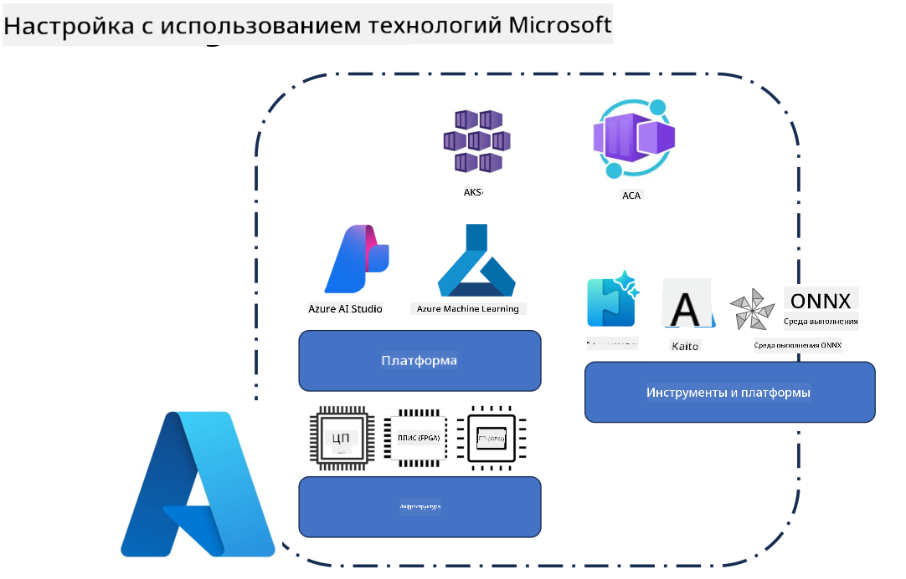
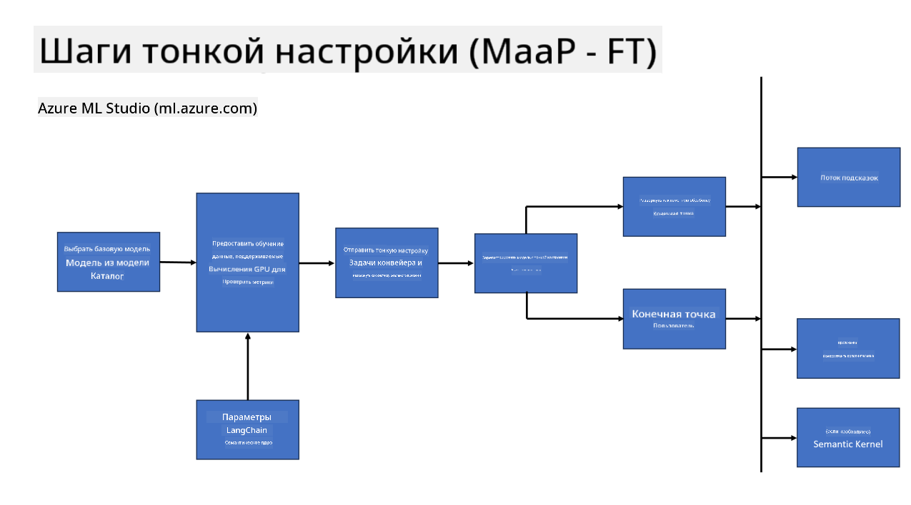
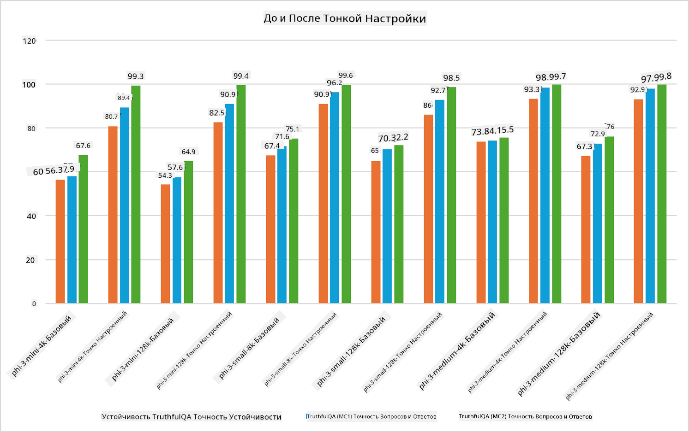

<!--
CO_OP_TRANSLATOR_METADATA:
{
  "original_hash": "cb5648935f63edc17e95ce38f23adc32",
  "translation_date": "2025-03-27T15:15:04+00:00",
  "source_file": "md\\03.FineTuning\\FineTuning_Scenarios.md",
  "language_code": "ru"
}
-->
## Сценарии тонкой настройки

**Платформа** Включает различные технологии, такие как Azure AI Foundry, Azure Machine Learning, AI Tools, Kaito и ONNX Runtime.

**Инфраструктура** Включает CPU и FPGA, которые являются важными элементами процесса тонкой настройки. Позвольте мне показать вам значки для каждой из этих технологий.

**Инструменты и фреймворки** Включает ONNX Runtime и ONNX Runtime. Позвольте мне показать вам значки для каждой из этих технологий.  
[Вставьте значки для ONNX Runtime и ONNX Runtime]

Процесс тонкой настройки с использованием технологий Microsoft включает различные компоненты и инструменты. Понимая и используя эти технологии, мы можем эффективно проводить тонкую настройку наших приложений и создавать лучшие решения.

## Модель как услуга

Тонкая настройка модели с использованием размещенной тонкой настройки без необходимости создания и управления вычислительными ресурсами.

Безсерверная тонкая настройка доступна для моделей Phi-3-mini и Phi-3-medium, позволяя разработчикам быстро и легко адаптировать модели для облачных и периферийных сценариев без необходимости организовывать вычислительные ресурсы. Мы также объявили, что Phi-3-small теперь доступна через наше предложение Models-as-a-Service, что позволяет разработчикам быстро и легко начать разработку AI без необходимости управления базовой инфраструктурой.

## Модель как платформа

Пользователи управляют своими вычислительными ресурсами для проведения тонкой настройки моделей.

[Пример тонкой настройки](https://github.com/Azure/azureml-examples/blob/main/sdk/python/foundation-models/system/finetune/chat-completion/chat-completion.ipynb)

## Сценарии тонкой настройки

| | | | | | | |
|-|-|-|-|-|-|-|
|Сценарий|LoRA|QLoRA|PEFT|DeepSpeed|ZeRO|DORA|
|Адаптация предварительно обученных LLM к конкретным задачам или областям|Да|Да|Да|Да|Да|Да|
|Тонкая настройка для задач NLP, таких как классификация текста, распознавание именованных сущностей и машинный перевод|Да|Да|Да|Да|Да|Да|
|Тонкая настройка для задач вопросов и ответов|Да|Да|Да|Да|Да|Да|
|Тонкая настройка для генерации ответов, похожих на человеческие, в чат-ботах|Да|Да|Да|Да|Да|Да|
|Тонкая настройка для создания музыки, искусства или других форм творчества|Да|Да|Да|Да|Да|Да|
|Снижение вычислительных и финансовых затрат|Да|Да|Нет|Да|Да|Нет|
|Снижение использования памяти|Нет|Да|Нет|Да|Да|Да|
|Использование меньшего числа параметров для эффективной тонкой настройки|Нет|Да|Да|Нет|Нет|Да|
|Эффективная по памяти форма параллелизма данных, обеспечивающая доступ к суммарной памяти GPU всех доступных устройств GPU|Нет|Нет|Нет|Да|Да|Да|

## Примеры производительности тонкой настройки

**Отказ от ответственности**:  
Этот документ был переведен с использованием сервиса автоматического перевода [Co-op Translator](https://github.com/Azure/co-op-translator). Несмотря на наши усилия обеспечить точность, пожалуйста, учитывайте, что автоматический перевод может содержать ошибки или неточности. Оригинальный документ на его исходном языке следует считать авторитетным источником. Для критически важной информации рекомендуется профессиональный перевод человеком. Мы не несем ответственности за любые недоразумения или неверные интерпретации, возникающие в результате использования данного перевода.