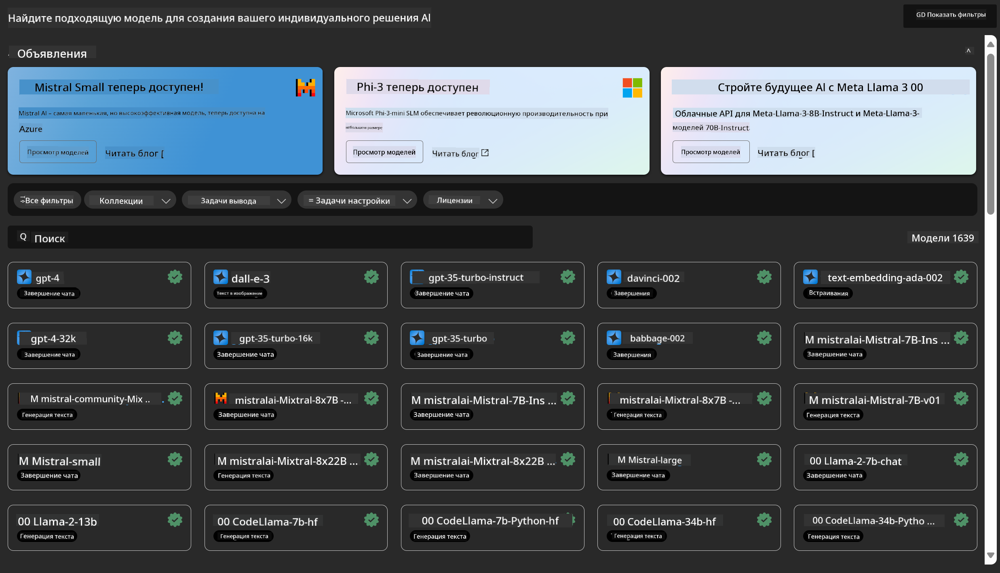
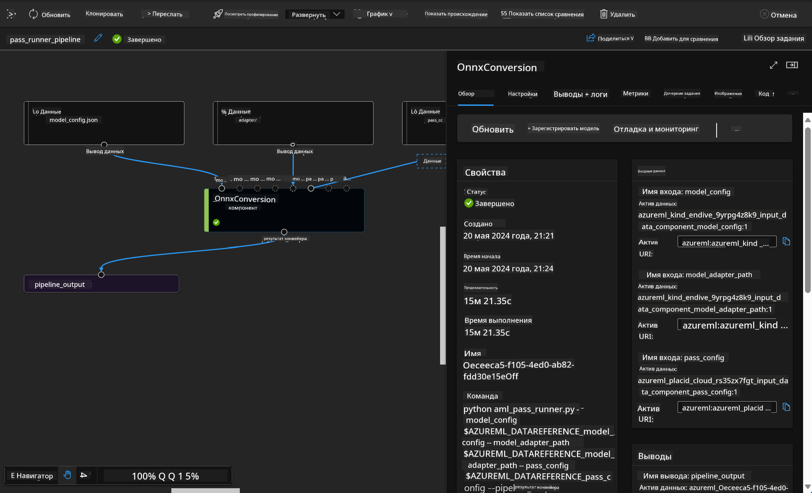

<!--
CO_OP_TRANSLATOR_METADATA:
{
  "original_hash": "7fe541373802e33568e94e13226d463c",
  "translation_date": "2025-03-27T15:51:35+00:00",
  "source_file": "md\\03.FineTuning\\Introduce_AzureML.md",
  "language_code": "ru"
}
-->
# **Введение в Azure Machine Learning Service**

[Azure Machine Learning](https://ml.azure.com?WT.mc_id=aiml-138114-kinfeylo) — это облачный сервис для ускорения и управления жизненным циклом проектов машинного обучения (ML).

Специалисты по ML, дата-сайентисты и инженеры могут использовать его в своей повседневной работе для:

- Обучения и развертывания моделей.
- Управления операциями машинного обучения (MLOps).
- Вы можете создать модель в Azure Machine Learning или использовать модель, разработанную на платформе с открытым исходным кодом, такой как PyTorch, TensorFlow или scikit-learn.
- Инструменты MLOps помогают отслеживать, переобучать и повторно развертывать модели.

## Для кого предназначен Azure Machine Learning?

**Дата-сайентисты и ML-инженеры**

Они могут использовать инструменты для ускорения и автоматизации своей повседневной работы.  
Azure ML предоставляет функции для обеспечения справедливости, объяснимости, отслеживаемости и возможности аудита.  

**Разработчики приложений**

Они могут легко интегрировать модели в приложения или сервисы.

**Платформенные разработчики**

Им доступен широкий набор инструментов, поддерживаемых надежными API Azure Resource Manager.  
Эти инструменты позволяют создавать сложные инструменты для ML.

**Предприятия**

Работая в облаке Microsoft Azure, предприятия получают выгоду от привычной безопасности и управления доступом на основе ролей.  
Настройте проекты для управления доступом к защищенным данным и определенным операциям.

## Продуктивность для всей команды

ML-проекты часто требуют команды с разнообразным набором навыков для их создания и поддержания.

Azure ML предоставляет инструменты, которые позволяют вам:
- Сотрудничать с командой через общие ноутбуки, вычислительные ресурсы, серверные вычисления, данные и окружения.
- Разрабатывать модели с учетом требований справедливости, объяснимости, отслеживаемости и возможности аудита для соблюдения стандартов и требований аудита.
- Быстро и легко развертывать ML-модели в масштабах и эффективно управлять ими с помощью MLOps.
- Выполнять рабочие нагрузки машинного обучения где угодно с встроенным управлением, безопасностью и соответствием требованиям.

## Инструменты платформы с поддержкой совместимости

Любой член команды ML может использовать свои предпочтительные инструменты для выполнения задач.  
Независимо от того, проводите ли вы быстрые эксперименты, настройку гиперпараметров, создание пайплайнов или управление выводами, вы можете использовать привычные интерфейсы, такие как:
- Azure Machine Learning Studio
- Python SDK (v2)
- Azure CLI (v2)
- REST API Azure Resource Manager

По мере того как вы совершенствуете модели и сотрудничаете в процессе разработки, вы можете делиться и находить ресурсы, данные и метрики в интерфейсе Azure Machine Learning studio.

## **LLM/SLM в Azure ML**

Azure ML добавил множество функций, связанных с LLM/SLM, объединяя LLMOps и SLMOps для создания корпоративной платформы генеративного искусственного интеллекта.

### **Каталог моделей**

Корпоративные пользователи могут развертывать различные модели в зависимости от бизнес-сценариев через Каталог моделей и предоставлять услуги в виде Model as Service для доступа разработчиков или пользователей.

Каталог моделей в Azure Machine Learning studio — это центр для поиска и использования широкого спектра моделей, которые позволяют создавать приложения на основе генеративного ИИ. Каталог моделей включает сотни моделей от таких провайдеров, как Azure OpenAI service, Mistral, Meta, Cohere, Nvidia, Hugging Face, а также модели, обученные Microsoft. Модели от провайдеров, кроме Microsoft, считаются продуктами сторонних производителей, как определено в Условиях использования продуктов Microsoft, и подчиняются условиям, предоставленным вместе с моделью.

### **Пайплайн задач**

Основой пайплайна машинного обучения является разделение полной задачи машинного обучения на многозадачный рабочий процесс. Каждый этап — это управляемый компонент, который можно разрабатывать, оптимизировать, настраивать и автоматизировать отдельно. Этапы соединяются через четко определенные интерфейсы. Сервис пайплайнов Azure Machine Learning автоматически организует все зависимости между этапами пайплайна.

При тонкой настройке SLM/LLM мы можем управлять данными, процессами обучения и генерации через пайплайн.

### **Prompt flow**

**Преимущества использования Azure Machine Learning prompt flow**  
Azure Machine Learning prompt flow предлагает множество преимуществ, которые помогают пользователям перейти от идеи к экспериментам и, в конечном итоге, к готовым к производству приложениям на основе LLM:

**Гибкость в проектировании запросов**  
Интерактивный процесс разработки: Azure Machine Learning prompt flow предоставляет визуальное представление структуры потока, позволяя пользователям легко понимать и ориентироваться в своих проектах. Также предлагается опыт кодирования, похожий на работу с ноутбуками, для эффективной разработки и отладки потоков.  
Варианты настройки запросов: Пользователи могут создавать и сравнивать несколько вариантов запросов, способствуя процессу итеративного совершенствования.  

Оценка: Встроенные потоки оценки позволяют пользователям оценивать качество и эффективность своих запросов и потоков.

Обширные ресурсы: Azure Machine Learning prompt flow включает библиотеку встроенных инструментов, примеров и шаблонов, которые служат отправной точкой для разработки, вдохновляют на творчество и ускоряют процесс.

**Готовность к корпоративным приложениям на основе LLM**  

Сотрудничество: Azure Machine Learning prompt flow поддерживает командную работу, позволяя нескольким пользователям совместно работать над проектами по проектированию запросов, делиться знаниями и поддерживать контроль версий.

Универсальная платформа: Azure Machine Learning prompt flow упрощает весь процесс проектирования запросов — от разработки и оценки до развертывания и мониторинга. Пользователи могут легко развертывать свои потоки как конечные точки Azure Machine Learning и отслеживать их производительность в реальном времени, обеспечивая оптимальную работу и постоянное улучшение.

Решения для корпоративной готовности Azure Machine Learning: Prompt flow использует надежные решения Azure Machine Learning для корпоративной готовности, обеспечивая безопасную, масштабируемую и надежную основу для разработки, экспериментов и развертывания потоков.

С помощью Azure Machine Learning prompt flow пользователи могут раскрыть гибкость в проектировании запросов, эффективно сотрудничать и использовать корпоративные решения для успешной разработки и развертывания приложений на основе LLM.

Объединяя вычислительные мощности, данные и различные компоненты Azure ML, корпоративные разработчики могут легко создавать свои собственные приложения искусственного интеллекта.

**Отказ от ответственности**:  
Этот документ был переведен с помощью службы автоматического перевода [Co-op Translator](https://github.com/Azure/co-op-translator). Хотя мы стремимся к точности, пожалуйста, учитывайте, что автоматизированные переводы могут содержать ошибки или неточности. Оригинальный документ на его родном языке следует считать авторитетным источником. Для получения критически важной информации рекомендуется профессиональный перевод человеком. Мы не несем ответственности за любые недоразумения или неправильные интерпретации, возникшие в результате использования этого перевода.