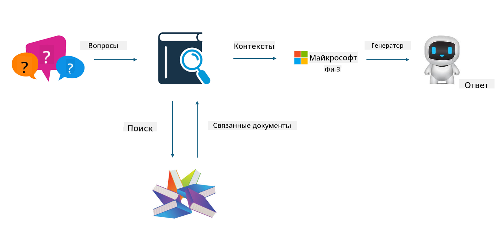
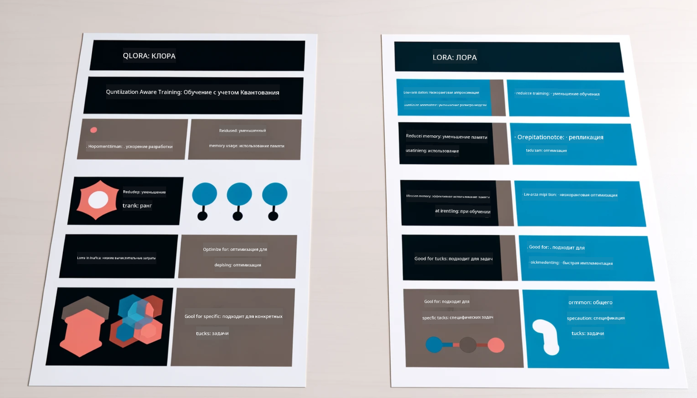

<!--
CO_OP_TRANSLATOR_METADATA:
{
  "original_hash": "743d7e9cb9c4e8ea642d77bee657a7fa",
  "translation_date": "2025-03-27T16:00:54+00:00",
  "source_file": "md\\03.FineTuning\\LetPhi3gotoIndustriy.md",
  "language_code": "ru"
}
-->
# **Пусть Phi-3 станет экспертом в отрасли**

Чтобы интегрировать модель Phi-3 в отрасль, необходимо добавить отраслевые бизнес-данные в модель Phi-3. У нас есть два различных подхода: RAG (Retrieval Augmented Generation) и Тонкая Настройка (Fine Tuning).

## **RAG против Тонкой Настройки**

### **Retrieval Augmented Generation**

RAG — это сочетание извлечения данных и генерации текста. Структурированные и неструктурированные данные предприятия хранятся в векторной базе данных. При поиске релевантного контента создается контекст из найденного резюме и содержания, а затем используется способность LLM/SLM к завершению текста для генерации контента.

### **Тонкая настройка**

Тонкая настройка основывается на улучшении существующей модели. Это не требует работы с алгоритмом модели с нуля, но требует постоянного накопления данных. Если вам нужно использовать более точную терминологию и выражения в отраслевых приложениях, тонкая настройка будет лучшим выбором. Однако, если ваши данные часто меняются, тонкая настройка может стать сложной.

### **Как выбрать**

1. Если наш ответ требует использования внешних данных, RAG — лучший выбор.

2. Если нужно предоставить стабильные и точные отраслевые знания, тонкая настройка будет хорошим вариантом. RAG ориентирован на извлечение релевантного контента, но может не всегда учитывать специализированные нюансы.

3. Для тонкой настройки требуется качественный набор данных, и если объем данных невелик, это не принесет значительных улучшений. RAG более гибок.

4. Тонкая настройка — это своего рода «черный ящик», метафизика, и внутренние механизмы трудно понять. Однако RAG позволяет легче находить источник данных, что эффективно помогает исправлять ошибки или галлюцинации в содержании и обеспечивает большую прозрачность.

### **Сценарии**

1. Для вертикальных отраслей, где требуется специфическая профессиональная терминология и выражения, ***Тонкая настройка*** будет лучшим выбором.

2. Для системы вопросов и ответов, включающей синтез различных знаний, ***RAG*** будет лучшим выбором.

3. Для автоматизации бизнес-процессов ***RAG + Тонкая настройка*** — лучший выбор.

## **Как использовать RAG**

Векторная база данных — это коллекция данных, хранящихся в математической форме. Векторные базы данных упрощают моделям машинного обучения запоминание предыдущих входных данных, что позволяет использовать машинное обучение для таких задач, как поиск, рекомендации и генерация текста. Данные идентифицируются на основе метрик сходства, а не точного соответствия, что позволяет моделям понимать контекст данных.

Векторная база данных — ключ к реализации RAG. Мы можем преобразовать данные в векторное хранилище с помощью векторных моделей, таких как text-embedding-3, jina-ai-embedding и др.

Узнайте больше о создании приложения RAG [https://github.com/microsoft/Phi-3CookBook](https://github.com/microsoft/Phi-3CookBook?WT.mc_id=aiml-138114-kinfeylo)

## **Как использовать Тонкую настройку**

Наиболее часто используемые алгоритмы для Тонкой настройки — это Lora и QLora. Как выбрать?
- [Подробнее в этом примере ноутбука](../../../../code/04.Finetuning/Phi_3_Inference_Finetuning.ipynb)
- [Пример Python-скрипта для Тонкой настройки](../../../../code/04.Finetuning/FineTrainingScript.py)

### **Lora и QLora**

LoRA (Low-Rank Adaptation) и QLoRA (Quantized Low-Rank Adaptation) — это методы, используемые для тонкой настройки больших языковых моделей (LLMs) с использованием параметрически эффективной настройки (PEFT). Техники PEFT разработаны для более эффективной тренировки моделей по сравнению с традиционными методами.  
LoRA — это автономная техника настройки, которая снижает объем памяти за счет применения низкоранговой аппроксимации к матрице обновления весов. Она обеспечивает быстрое обучение и сохраняет производительность, близкую к традиционным методам настройки.

QLoRA — это расширенная версия LoRA, которая включает методы квантования для дальнейшего сокращения использования памяти. QLoRA квантует точность параметров весов в предварительно обученной модели LLM до 4-битной точности, что более эффективно по памяти, чем LoRA. Однако обучение с QLoRA примерно на 30% медленнее, чем с LoRA, из-за дополнительных шагов квантования и деквантования.

QLoRA использует LoRA в качестве дополнения для исправления ошибок, возникающих в процессе квантования. QLoRA позволяет выполнять тонкую настройку массивных моделей с миллиардами параметров на относительно небольших и доступных GPU. Например, QLoRA может настроить модель с 70 миллиардами параметров, которая обычно требует 36 GPU, всего на 2.

**Отказ от ответственности**:  
Этот документ был переведен с помощью сервиса автоматического перевода [Co-op Translator](https://github.com/Azure/co-op-translator). Несмотря на наши усилия обеспечить точность перевода, обратите внимание, что автоматические переводы могут содержать ошибки или неточности. Оригинальный документ на его исходном языке следует считать авторитетным источником. Для получения критически важной информации рекомендуется профессиональный перевод человеком. Мы не несем ответственности за любые недоразумения или неправильные интерпретации, возникшие в результате использования данного перевода.