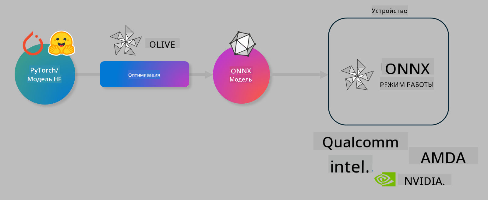

<!--
CO_OP_TRANSLATOR_METADATA:
{
  "original_hash": "6bbe47de3b974df7eea29dfeccf6032b",
  "translation_date": "2025-03-27T16:16:16+00:00",
  "source_file": "md\\03.FineTuning\\olive-lab\\readme.md",
  "language_code": "ru"
}
-->
# Лаборатория. Оптимизация AI-моделей для локального выполнения

## Введение

> [!IMPORTANT]
> Для этой лабораторной работы требуется **GPU Nvidia A10 или A100** с установленными драйверами и CUDA toolkit (версии 12+).

> [!NOTE]
> Это **35-минутная** лабораторная работа, которая познакомит вас с основами оптимизации моделей для локального выполнения с использованием OLIVE.

## Цели обучения

По завершении этой лабораторной работы вы сможете использовать OLIVE для:

- Квантования AI-модели с использованием метода AWQ.
- Тонкой настройки AI-модели для выполнения конкретной задачи.
- Генерации LoRA-адаптеров (модели с тонкой настройкой) для эффективного локального выполнения в ONNX Runtime.

### Что такое Olive

Olive (*O*NNX *live*) — это инструмент для оптимизации моделей с интерфейсом командной строки, который позволяет создавать модели для ONNX Runtime +++https://onnxruntime.ai+++ с высоким качеством и производительностью.



Исходными данными для Olive обычно являются модели PyTorch или Hugging Face, а результатом — оптимизированная модель ONNX, выполняемая на устройстве (целевой платформе) с ONNX Runtime. Olive оптимизирует модель для AI-ускорителя целевой платформы (NPU, GPU, CPU), предоставляемого производителем оборудования, таким как Qualcomm, AMD, Nvidia или Intel.

Olive выполняет *рабочий процесс*, который представляет собой упорядоченную последовательность отдельных задач оптимизации модели, называемых *passes*. Примеры задач: сжатие модели, захват графа, квантование, оптимизация графа. Каждая задача имеет набор параметров, которые можно настроить для достижения наилучших показателей, таких как точность и задержка, оцениваемые соответствующим оценщиком. Olive использует стратегию поиска, применяя алгоритм для автоматической настройки каждой задачи по отдельности или группы задач вместе.

#### Преимущества Olive

- **Снижение времени и усилий**, затрачиваемых на эксперименты методом проб и ошибок с различными техниками оптимизации графа, сжатия и квантования. Задайте свои требования к качеству и производительности, и Olive автоматически найдет для вас лучшую модель.
- **40+ встроенных компонентов оптимизации моделей**, охватывающих передовые методы квантования, сжатия, оптимизации графа и тонкой настройки.
- **Простой интерфейс командной строки** для выполнения задач оптимизации модели. Например, olive quantize, olive auto-opt, olive finetune.
- Встроенная упаковка и развертывание моделей.
- Поддержка создания моделей для **Multi LoRA serving**.
- Возможность создания рабочих процессов с использованием YAML/JSON для организации задач оптимизации и развертывания моделей.
- Интеграция с **Hugging Face** и **Azure AI**.
- Встроенный механизм **кэширования** для **снижения затрат**.

## Инструкции к лабораторной работе
> [!NOTE]
> Убедитесь, что вы настроили Azure AI Hub и проект, а также подготовили вычислительный ресурс A100 в соответствии с Лабораторной работой 1.

### Шаг 0: Подключение к Azure AI Compute

Вы подключитесь к Azure AI Compute, используя функцию удаленного подключения в **VS Code.** 

1. Откройте настольное приложение **VS Code**:
1. Откройте **командную палитру**, используя **Shift+Ctrl+P**.
1. В командной палитре найдите **AzureML - remote: Connect to compute instance in New Window**.
1. Следуйте инструкциям на экране для подключения к Compute. Это будет включать выбор вашей подписки Azure, группы ресурсов, проекта и имени вычислительного ресурса, настроенного в Лабораторной работе 1.
1. После подключения к узлу Azure ML Compute это будет отображено в **нижнем левом углу Visual Code** `><Azure ML: Compute Name`.

### Шаг 1: Клонирование репозитория

В VS Code вы можете открыть новый терминал с помощью **Ctrl+J** и клонировать этот репозиторий:

В терминале вы должны увидеть запрос

```
azureuser@computername:~/cloudfiles/code$ 
```
Клонируйте решение 

```bash
cd ~/localfiles
git clone https://github.com/microsoft/phi-3cookbook.git
```

### Шаг 2: Открытие папки в VS Code

Чтобы открыть VS Code в соответствующей папке, выполните следующую команду в терминале, которая откроет новое окно:

```bash
code phi-3cookbook/code/04.Finetuning/Olive-lab
```

Или вы можете открыть папку, выбрав **File** > **Open Folder**.

### Шаг 3: Установка зависимостей

Откройте окно терминала в VS Code на вашем узле Azure AI Compute (совет: **Ctrl+J**) и выполните следующие команды для установки зависимостей:

```bash
conda create -n olive-ai python=3.11 -y
conda activate olive-ai
pip install -r requirements.txt
az extension remove -n azure-cli-ml
az extension add -n ml
```

> [!NOTE]
> Установка всех зависимостей займет около ~5 минут.

В этой лабораторной работе вы будете загружать и выгружать модели в каталог моделей Azure AI. Чтобы получить доступ к каталогу моделей, вам нужно будет войти в Azure, используя:

```bash
az login
```

> [!NOTE]
> При входе в систему вам будет предложено выбрать вашу подписку. Убедитесь, что вы выбрали подписку, предоставленную для этой лабораторной работы.

### Шаг 4: Выполнение команд Olive 

Откройте окно терминала в VS Code на вашем узле Azure AI Compute (совет: **Ctrl+J**) и убедитесь, что активирована среда `olive-ai` conda:

```bash
conda activate olive-ai
```

Затем выполните следующие команды Olive в командной строке.

1. **Исследование данных:** В этом примере вы будете настраивать модель Phi-3.5-Mini, чтобы она специализировалась на ответах на вопросы, связанные с путешествиями. Код ниже отображает первые несколько записей набора данных, который представлен в формате JSON lines:
   
    ```bash
    head data/data_sample_travel.jsonl
    ```
1. **Квантование модели:** Перед обучением модели сначала выполните квантование с помощью следующей команды, использующей технику Active Aware Quantization (AWQ) +++https://arxiv.org/abs/2306.00978+++. AWQ выполняет квантование весов модели, учитывая активации, возникающие во время выполнения. Это означает, что процесс квантования учитывает фактическое распределение данных в активациях, что позволяет лучше сохранить точность модели по сравнению с традиционными методами квантования весов.
    
    ```bash
    olive quantize \
       --model_name_or_path microsoft/Phi-3.5-mini-instruct \
       --trust_remote_code \
       --algorithm awq \
       --output_path models/phi/awq \
       --log_level 1
    ```
    
    Процесс квантования AWQ займет **около 8 минут** и **уменьшит размер модели с ~7.5GB до ~2.5GB**.
   
   В этой лабораторной работе мы показываем, как вводить модели из Hugging Face (например: `microsoft/Phi-3.5-mini-instruct`). However, Olive also allows you to input models from the Azure AI catalog by updating the `model_name_or_path` argument to an Azure AI asset ID (for example:  `azureml://registries/azureml/models/Phi-3.5-mini-instruct/versions/4`). 

1. **Train the model:** Next, the `olive finetune` команда настраивает квантованную модель. Квантование модели *до* настройки вместо после дает лучшую точность, так как процесс настройки восстанавливает часть потерь от квантования.
    
    ```bash
    olive finetune \
        --method lora \
        --model_name_or_path models/phi/awq \
        --data_files "data/data_sample_travel.jsonl" \
        --data_name "json" \
        --text_template "<|user|>\n{prompt}<|end|>\n<|assistant|>\n{response}<|end|>" \
        --max_steps 100 \
        --output_path ./models/phi/ft \
        --log_level 1
    ```
    
    Настройка займет **около 6 минут** (100 шагов).

1. **Оптимизация:** После обучения модели вы оптимизируете ее, используя команду Olive `auto-opt` command, which will capture the ONNX graph and automatically perform a number of optimizations to improve the model performance for CPU by compressing the model and doing fusions. It should be noted, that you can also optimize for other devices such as NPU or GPU by just updating the `--device` and `--provider` - но для целей этой лабораторной работы мы будем использовать CPU.

    ```bash
    olive auto-opt \
       --model_name_or_path models/phi/ft/model \
       --adapter_path models/phi/ft/adapter \
       --device cpu \
       --provider CPUExecutionProvider \
       --use_ort_genai \
       --output_path models/phi/onnx-ao \
       --log_level 1
    ```
    
    Оптимизация займет **около 5 минут**.

### Шаг 5: Быстрое тестирование выполнения модели

Чтобы протестировать выполнение модели, создайте файл Python в вашей папке с именем **app.py** и скопируйте следующий код:

```python
import onnxruntime_genai as og
import numpy as np

print("loading model and adapters...", end="", flush=True)
model = og.Model("models/phi/onnx-ao/model")
adapters = og.Adapters(model)
adapters.load("models/phi/onnx-ao/model/adapter_weights.onnx_adapter", "travel")
print("DONE!")

tokenizer = og.Tokenizer(model)
tokenizer_stream = tokenizer.create_stream()

params = og.GeneratorParams(model)
params.set_search_options(max_length=100, past_present_share_buffer=False)
user_input = "what is the best thing to see in chicago"
params.input_ids = tokenizer.encode(f"<|user|>\n{user_input}<|end|>\n<|assistant|>\n")

generator = og.Generator(model, params)

generator.set_active_adapter(adapters, "travel")

print(f"{user_input}")

while not generator.is_done():
    generator.compute_logits()
    generator.generate_next_token()

    new_token = generator.get_next_tokens()[0]
    print(tokenizer_stream.decode(new_token), end='', flush=True)

print("\n")
```

Выполните код, используя:

```bash
python app.py
```

### Шаг 6: Загрузка модели в Azure AI

Загрузка модели в репозиторий моделей Azure AI позволяет делиться моделью с другими членами вашей команды разработки, а также обеспечивает контроль версий модели. Чтобы загрузить модель, выполните следующую команду:

> [!NOTE]
> Обновите `{}` placeholders with the name of your resource group and Azure AI Project Name. 

To find your resource group `"resourceGroup"` и имя проекта Azure AI, затем выполните следующую команду 

```
az ml workspace show
```

Или перейдите на +++ai.azure.com+++ и выберите **management center** **project** **overview**.

Обновите `{}` заполнители именем вашей группы ресурсов и именем проекта Azure AI.

```bash
az ml model create \
    --name ft-for-travel \
    --version 1 \
    --path ./models/phi/onnx-ao \
    --resource-group {RESOURCE_GROUP_NAME} \
    --workspace-name {PROJECT_NAME}
```
Затем вы сможете увидеть загруженную модель и развернуть ее на https://ml.azure.com/model/list.

**Отказ от ответственности**:  
Этот документ был переведен с использованием сервиса автоматического перевода [Co-op Translator](https://github.com/Azure/co-op-translator). Несмотря на наше стремление к точности, автоматические переводы могут содержать ошибки или неточности. Оригинальный документ на его родном языке следует считать авторитетным источником. Для критически важной информации рекомендуется профессиональный перевод человеком. Мы не несем ответственности за недоразумения или неправильное толкование, возникшие в результате использования данного перевода.